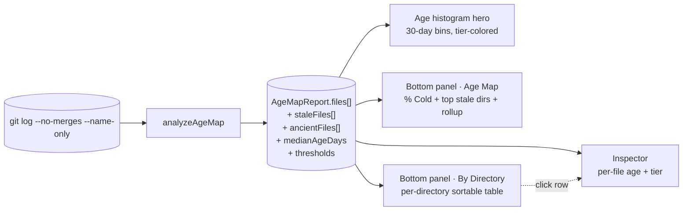

# Age Map

**Age Map** measures `daysSinceLastCommit` for every tracked file in the repository and classifies the codebase into four tiers — `fresh / aging / stale / ancient` — based on repo-age-relative thresholds. The headline question is *"how much of this codebase has gone cold?"*, where "cold" is the combined share of files in the stale and ancient tiers. A repository's age distribution is a fingerprint: a long ancient tail signals deferred maintenance, a bimodal split suggests an active core wrapped in frozen archives, and a smooth aging plateau usually means a mature library where stability is the goal.

The Age Map analyzer answers two questions on the same screen:

- **"What's the shape of staleness across the codebase?"** — the histogram tells you whether old files are concentrated, smoothly distributed, or split into active and frozen halves.
- **"Where does the cold mass actually live?"** — the directory rollup names the parts of the tree carrying the deferred-maintenance weight.

Why this matters: knowing a repo has 986 ancient files is much less useful than knowing 986 ancient files all live under `compiler/__tests__/fixtures/`. The first reads as "this codebase is dying"; the second reads as "the fixture sprawl is the noise floor — read past it." The analyzer surfaces both views deliberately, on the same screen, so you don't get fooled by either.

::: tip Screenshot
**TODO:** Capture the Age Map analyzer view (sidebar selection, `Age` histogram hero, bottom-panel `Age Map` and `By Directory` tabs, right-side Inspector populated). Save to `apps/docs/public/images/analyzers/age-map-overview.png`, then replace this callout with ``.
:::

## Quick read

If you only have ten seconds:

- **Top of the screen** (`Age` histogram) — distribution of last-commit age across all tracked files in 30-day bins. Bar height is file count, color is tier (`fresh / aging / stale / ancient`), and the `>staleLimit` zone is shaded so the ancient tail is visible at a glance.
- **Metrics strip** — median age (in days), ancient count, stale count, fresh count. The headline numbers most often quoted in standups.
- **Bottom panel** (`Age Map` tab, default) — narrative-KPI showing the repo's `% Cold` headline, the top stale directories, the four-tier mix breakdown, and a "where they live" rollup of the top directories by ancient-file count.
- **Bottom panel** (`By Directory` tab) — sortable table of every directory with file count, median age, per-tier breakdown, and the directory's oldest file. The data lens for users who want to dig.
- **Right-side Inspector** — click any file row in another analyzer's tab to see its `Age` (`N days (tier)`) alongside hotspot, churn, bus factor, blast radius, and the rest.

## How age is measured

The full pipeline, from raw git output to the dashboard surfaces:

For each tracked file, the analyzer scans the commit log to find the most recent commit that touched it, then computes the integer day delta between that commit and `now`. That delta becomes `ageInDays`, and the file's repo-age-relative tier becomes its `status`.

A few specifics worth knowing:

- **Window:** the full reachable history of the analyzed branch, bounded by `--since=<date>` if provided. The `repoAgeDays` value used for threshold scaling comes from the analysis-window length (first commit to today), not the full git history.
- **Merge commits are excluded** (`--no-merges`). A merge that re-touches 50 files via merge mechanics doesn't refresh those files' ages — only the original commits on the merged branches count.
- **Only currently-tracked files appear.** Files that were deleted before scan time aren't in `git ls-files`, so they're filtered out — even if their old commits are still in the log. They live in the raw `report.commits` array but don't surface in the analyzer's output.
- **Renames are *not* followed.** A file's `ageInDays` reflects only commits made under its current name. Pre-rename history is attributed to the old path and won't bring the current path's age down. The [Rename Tracking](/analyzers/rename-tracking) analyzer surfaces these chains explicitly when you need continuity.
- **Median is the upper-middle for even-length arrays** (`sorted[Math.floor(n/2)]`), consistent across the analyzer and the per-directory rollup. This is a deliberate convention — the directional signal is what matters, not the arithmetic mean of two middles.

## The four tiers

The threshold boundaries scale to repo age, so "stale" means the same thing in spirit across a 90-day prototype and a 5-year codebase. The percentages are anchors: a file is fresh if it was touched in the most recent 8% of the analysis window, aging if in the next 25%, stale if in the next 33%, and ancient if it's been untouched longer than two-thirds of the window.

| Tier | Threshold | Meaning |
|---|---|---|
| **fresh** | `ageInDays ≤ round(repoAgeDays × 0.08)` | Recently touched. The active surface of the codebase. |
| **aging** | `ageInDays ≤ round(repoAgeDays × 0.33)` | Mature but still in rotation. Healthy state for most files. |
| **stale** | `ageInDays ≤ round(repoAgeDays × 0.66)` | Going cold. May be stable, may be neglected — the [Cursed Files](/analyzers/cursed-files) and [Stale Files](/analyzers/dead-code) analyzers help disambiguate. |
| **ancient** | `ageInDays > round(repoAgeDays × 0.66)` | Likely deferred maintenance, generated content, or critical infrastructure nobody dares touch. |

The exact threshold values for the current repo are exposed on the report at `ageMap.thresholds.{freshLimit, agingLimit, staleLimit}` so the histogram, the panel, and the inspector all read the same boundaries without duplicating the formula. For a 365-day window: fresh ≤ 29 days, aging ≤ 120 days, stale ≤ 241 days, ancient > 241 days.

::: tip Why repo-age-relative
Fixed thresholds (e.g. "stale = 90 days") make a one-month-old prototype look healthy and a five-year-old library look catastrophic, even when both are equally well-maintained. The 8/33/66% anchors hold meaning constant: a file untouched for two-thirds of the analysis window is "ancient" whether the window is 90 days or 5,000.
:::

## Reading the surfaces

### The hero — `Age` histogram

A distribution histogram of `ageInDays` across all tracked files, bucketed in widths of 30 days (`0–29`, `30–59`, `60–89`, …). Bar count caps at 18 in-range bins (covering 540 days), with an overflow `540+` bin appended on longer windows so older files don't push the chart off-screen. Bars are colored by the tier of the bucket's midpoint, and the right side of the chart is shaded to mark the **going-cold threshold** (`>staleLimit`) — the same threshold the analyzer's `status === 'ancient'` band uses, snapped cleanly to the bucket boundary so the visual, the tier, and the panel agree.

The hero answers **"what's the shape of staleness across the repo?"** Three shapes, three different stories:

- **Long ancient tail** — files at every age, with a fat right side past `staleLimit`. The deferred-maintenance pathology: the codebase has accumulated old files faster than it sheds them. Read the bottom panel's "Where they live" rollup; if the tail clusters in `__tests__/fixtures/` or `__snapshots__/`, that's the noise floor, not the engineering surface. If the tail spans `src/` and core packages, the codebase has real archaeology to do.
- **Bimodal active-vs-archive** — a hump on the left (recent commits) and a separate hump on the right (ancient files). The codebase has a clear active core wrapped in a frozen archive. Common on libraries with stabilized older modules and a smaller area of new development. The bottom panel's `By Directory` tab tells you where each hump lives.
- **Smooth aging plateau** — a roughly even spread across all bins, no obvious clusters. The codebase is mature and steadily-edited, with no ancient debt and no fresh-code rush. Healthy distribution; the headline `% Cold` should be modest (under 50%).

A note on histogram coloring versus per-file tier: the histogram colors each bar by the tier of its **midpoint**, while the analyzer classifies each **file** individually. Most of the time these agree, but a file at age 28 lands in the `0–29` bin (visually colored fresh by midpoint 14.5) yet may be classified `aging` if the repo's `freshLimit` is 27. The histogram is a visual approximation; the strip's tier counts and the panel's tier mix are authoritative.

### The bottom panel — `Age Map` tab (default, narrative-KPI)

A single panel, not a table. The left-side big number is **`% Cold`** — the share of tracked files in the stale or ancient tiers — badge-colored by severity:

| Tier | `% Cold` | Badge |
|---|---|---|
| **Healthy** | < 25% | healthy |
| **Moderate** | 25–49% | warning |
| **High** | 50–74% | critical |
| **Critical** | ≥ 75% | critical |

The thresholds are anchored on the share of stale + ancient files combined. A `Healthy` repo is one where less than a quarter has gone cold; a `Critical` repo is one where three quarters or more has. On a mature React-scale codebase, expect to see `High` or `Critical` — the tier is honest about what mature codebases look like, not alarmist.

The right side carries three pieces of context:

1. **Top stale directories** — the three directories with the highest median age, with their median value and ancient count. Surfaces "what corners of the tree have aged the most" rather than "what individual files are oldest" (which would be a wall of identically-old fixture files on real repos). The directory framing dodges the fixture-noise pathology cleanly.
2. **Tier mix subline** — the count of files in each of the four tiers (`fresh / aging / stale / ancient`), each colored by tier identity. The four numbers sum to the total tracked file count and answer "how is the codebase distributed across the tiers?" — visible in the histogram's shape but quantified here.
3. **"Where they live" rollup** — directory-level breakdown of the *ancient* files. Each row shows the immediate parent directory, a count bar visualizing relative concentration, the ancient-file count, and the share of the repo's total ancient count. Top 5 directories by ancient count, sorted desc with alphabetical tiebreak. Directories already shown in the "Top stale directories" finding are excluded so the same directory never appears twice on the screen — the extras section surfaces *additional* dirs beyond the finding's top three. When more than 5 distinct extra directories hold ancient files, the rollup ends with a `+ N more directories` line.

The sticky **See also** footer links to two related analyzers:

- **[Stale Files](/analyzers/dead-code)** — a tighter cousin: the dead-code analyzer narrows from "what's old" to "what's old AND probably abandoned" by intersecting age, LOC, and churn. Ancient files that also have substantial size and zero churn earn the dead-code label.
- **[Cursed Files](/analyzers/cursed-files)** — multi-dimensional risk view. Ancient files that are also high-churn, single-owned, or shame-tagged earn the curse — they're the worst kind of old: not stable, just neglected.

### The bottom panel — `By Directory` tab

A sortable table with one row per directory and seven columns. Different unit of analysis from the histogram (per-directory, not per-file), and a different ranking lens than the narrative-KPI's "Where they live" rollup (full sort surface, all columns visible, no filtering).

| Column | What it shows |
|---|---|
| **Directory** | Parent directory path. Files at the repo root render as `(root)`. |
| **Files** | Number of tracked files in the directory. |
| **Median Age** | The directory's median `ageInDays`, **tier-toned** — red when above the repo's `staleLimit`, orange when above `agingLimit`, default secondary text otherwise. |
| **Ancient** | Count of files in the ancient tier (red when > 0, dimmed when zero). |
| **Stale** | Count of files in the stale tier (orange when > 0). |
| **Fresh** | Count of files in the fresh tier. |
| **Oldest File** | Basename + parent path of the oldest single file in the directory. Anchor for what's driving the row's median. |

The default sort is **Median Age** descending, set at the aggregator boundary. You can re-sort by `Files`, `Median Age`, `Ancient`, `Stale`, `Fresh`, or `Oldest File` (sorted by age days) interactively by clicking the header. Click any row to open the directory's oldest file in the right-side Inspector.

The default sort is the lens that matches the analyzer's headline question — "where has the codebase aged the most?" — but the table doesn't lock you into it. If the deferred-maintenance question is more pressing, sort by `Ancient` desc to find the directories absorbing the most cold files; if you're hunting for active development surface, sort by `Fresh` desc to find the corners of the tree that still move.

### The right-side Inspector

Click any file row in another analyzer's tab and the Inspector populates with that file's full per-file profile, including `Age` rendered as `N days (tier)`. The Inspector is the place to drill into a single file; the histogram and the directory table are the places to scan many files at once.

## What action it suggests

Age Map is a triage signal, not an indictment. A few patterns to act on:

- **Long ancient tail concentrated in `__tests__/fixtures/`, `__snapshots__/`, or generated subtrees** — almost always safe to ignore on the engineering-risk axis. Generated content has no "freshness" expectations; the file age reflects "when was this last regenerated" more than "when was this last understood." Sanity-check by reading the `By Directory` table — if the top ancient rows are all generated, the panel's `% Cold` headline is overstating the engineering signal.
- **Long ancient tail in `src/` or core packages** — the deferred-maintenance signal that actually matters. Cross-reference the [Cursed Files](/analyzers/cursed-files) tab; ancient files that are also flagged as cursed are the highest-priority archaeology candidates.
- **Bimodal active-vs-archive distribution with a single dominant author in the active hump** — read the [Bus Factor](/analyzers/bus-factor) panel together; the active hump may have ownership-concentration risk that Age Map can't see.
- **Smooth aging plateau with `% Cold` in the High or Critical tier** — common on mature libraries (e.g. React's compiler subtree). The codebase is healthy *for what it is*; the tier is reporting "this codebase is mature and stable," not "this codebase is dying." Use the histogram and `By Directory` table to confirm there's no concentrated rot before treating the headline as a problem.
- **Median age shifts dramatically between scans** — usually an analysis-window change rather than a real codebase shift. The metrics strip's "MEDIAN AGE" can swing 100+ days when `--since=<date>` is added or removed because `repoAgeDays` (the threshold denominator) changes too. Compare the same `--since` window to track real shifts.

## Limitations

- **Last-commit age, not edit volume.** A file with one minor commit per month and a file with 200 commits per month both look "fresh" in this analyzer. Pair with [Churn](/analyzers/churn) for activity-volume; pair with [Churn Velocity](/analyzers/churn-velocity) to ask whether the activity is accelerating or decelerating.
- **Only currently-tracked files appear.** Files deleted before scan time are excluded from the rollup, even though their commits are still in the log. The dashboard's headline counts (986 ancient, 818 stale, etc.) reflect only the currently-tracked surface.
- **Renames break continuity.** A file's `ageInDays` reflects only commits made under its current path. A renamed file looks young from the rename forward, even if the underlying logic has existed for years. Use [Rename Tracking](/analyzers/rename-tracking) to reconstruct full lifecycles.
- **Histogram caps at 540 days plus an overflow bin.** Files older than 540 days collapse into a single `540+` bar. On a multi-year repo with deep archaeology, the overflow bin can hide useful texture in the deep tail. The `By Directory` table is the right surface for that question; it shows actual ages without clamping.
- **Threshold percentages (8/33/66%) are heuristic, not configuration.** They're chosen to give meaningful tier separation at any window size, but they're not yet user-tunable. A repo with a fundamentally different release cadence may want different anchors; this is on the roadmap.
- **Repo-age-relative thresholds reset every analysis.** A file that was "stale" yesterday can be "aging" today if the analysis window grew, even though the file itself hasn't changed. The analyzer measures how cold a file is *relative to the codebase's current activity*, not relative to a fixed calendar date.
- **Pre-1.0.** Threshold percentages, the histogram bin width, the 540-day cap, and the tier definitions may change. See [CHANGELOG](https://github.com/nebulord-dev/gitrelic/blob/main/CHANGELOG.md) for shifts.

## Related analyzers

- **[Stale Files](/analyzers/dead-code)** — narrows Age Map's "what's old" question to "what's old AND probably abandoned" by intersecting age with LOC and churn. Ancient files with substantial size and zero recent activity earn the dead-code label.
- **[Cursed Files](/analyzers/cursed-files)** — multi-dimensional risk score that incorporates age as one of its inputs. Ancient files that are also high-churn, single-owned, or shame-tagged frequently overlap with this analyzer's worst rows.
- **[Churn](/analyzers/churn)** — the flip side: which files have the most commits in the analysis window, irrespective of recency. A file can be both highly-churned (many recent commits) and highly-aged (last commit was years ago) only if the window wraps around — typically not.
- **[Churn Velocity](/analyzers/churn-velocity)** — is a file's activity accelerating or decelerating? An aging file with decelerating churn is stabilizing; an aging file with accelerating churn is being abandoned mid-edit.
- **[Complexity Trend](/analyzers/complexity-trend)** — month-by-month file size growth. Pairs with Age Map to ask "is this old file also bloating, or has it stabilized?"
- **[Web Dashboard](/dashboard/)** — the rendering layer that hosts the Age histogram and the two-tab bottom panel.
