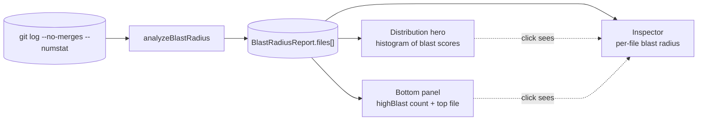

# Blast Radius

**Blast Radius** measures how many *other* files a given file tends to change with. A file with high blast radius is an architectural load-bearer: it can't be touched in isolation. Renaming a symbol, refactoring a contract, or fixing a bug there reliably costs you N other-file edits in the same commit. The analyzer ranks every tracked file by the average size of its co-change cohort, normalizes to a 0–100 score, and flags files at the cascade-risk threshold.

The Blast Radius analyzer answers one question:

- **"Which files drag the rest of the codebase along when they change?"**

Why this matters: blast radius is a coordination cost. High-blast files can't be evolved by one person on one branch — every change to them touches a wide surface and risks merge conflicts, broken tests, and review burnout. They're also the files where inadequate test coverage hurts the most, because a regression in one of them ripples.

::: tip Screenshot
**TODO:** Capture the Blast Radius analyzer view (sidebar selection, distribution histogram hero, bottom-panel narrative-KPI, right-side Inspector populated). Save to `apps/docs/public/images/analyzers/blast-radius-overview.png`, then replace this callout with ``.
:::

## Quick read

If you only have ten seconds:

- **Top of the screen** (`Distribution` hero) — histogram of the repo's blast scores, bucketed 0–100. The shaded right zone (≥70) is the cascade-risk band.
- **Bottom panel** (narrative KPI) — count of files in the cascade-risk band and the worst offender.
- **Right-side Inspector** — click any file in another analyzer's tab to see its blast radius alongside its hotspot, churn, ownership, and age detail.

## How blast radius is measured

The full pipeline, from raw git output to the dashboard surfaces:

For each commit, the analyzer counts how many *other* tracked files appeared alongside each file in that commit. After processing every commit, each file has a list of co-change cohort sizes. Two numbers fall out per file:

- **`avgCoChangedFiles`** — the mean cohort size across all of the file's commits.
- **`maxCoChangedFiles`** — the largest cohort the file was ever caught in (its peak).

The 0–100 **`blastScore`** is the file's average normalized against the repo's hottest file's average (top file = 100).

A few specifics worth knowing:

- **Window**: the full reachable history of the analyzed branch, bounded by `--since=<date>` if provided.
- **Merge commits are excluded** (`--no-merges`). Otherwise an octopus merge that touches 200 files would inflate every file's blast score artificially.
- **Mass-change commits are excluded.** Any commit touching 30 or more tracked files is dropped from the calculation — these are typically reformatting, license header changes, or initial commits, none of which signal architectural coupling. The cap is a constant (`MAX_FILES_PER_COMMIT = 30`) and applies uniformly.
- **Only currently-tracked files are scored.** Files that were deleted before scan time aren't in `git ls-files`, so they're filtered out — even if their old commits are still in the log.
- **Renames are *not* followed.** A renamed file's pre-rename blast history is attributed to the old path. The [Rename Tracking](/analyzers/rename-tracking) analyzer surfaces these chains explicitly when you need to reconstruct continuity.

## The four tiers

Each file's `blastScore` buckets into four tiers, used to color the histogram:

| Tier | Score | Meaning |
|---|---|---|
| **low** | < 25 | Mostly changes alone. Local concerns. |
| **medium** | 25–49 | Modest co-change cohort. Normal coupling. |
| **high** | 50–75 | Wide co-change cohort. Touch with care. |
| **critical** | 76–100 | Top tier. Every change here drags many others. |

The narrative-KPI's headline number uses a slightly different cut: **files with `blastScore` ≥ 70** ("high blast"). That threshold is broader than the *critical* tier — it captures the upper half of *high* plus all of *critical*, giving the panel a more useful headcount of "files that hurt to touch" than the strict tier boundaries would.

## Reading the surfaces

### The hero — `Distribution`

A 10-bin histogram of `blastScore` across all analyzed files, bucketed in widths of 10 (0–9, 10–19, …, 90–100). Bars are colored by the tier of the bucket's midpoint, and the right side of the chart is shaded to mark the **high-blast threshold** (`≥70`) — the same threshold the bottom panel's headline number uses.

The hero answers **"is blast risk concentrated or evenly distributed?"** Three shapes, three different stories:

- **Left-leaning long tail** — most files change alone or in small cohorts; a few bars sneak into the high band. Healthy. The KPI count is small; the few high-blast files are isolated load-bearers worth knowing about.
- **Bimodal** — a hump in the low–medium range and a second smaller hump in the high band. The codebase has a clear architectural core that everything else orbits.
- **Right-shifted distribution** — files cluster in the medium-to-high range with very little in *low*. This is unusual and usually means coupling is repo-wide: most files are wired into many others. Consider whether the analysis window is too short (small windows can inflate everything's apparent coupling).

### The bottom panel — narrative KPI

A single panel, not a table. The left-side big number is **the count of files with `blastScore` ≥ 70**, badge-colored by severity (0 = low, 1–9 = moderate, 10+ = high).

The right side carries two pieces of context:

1. **Top blast files** — the three worst offenders by `blastScore`, with their `avgCoChangedFiles` and `maxCoChangedFiles`. Three is enough to show "the worst is not alone" without making the panel feel like a table; the right-side Inspector remains the place to drill into any single file's full profile.
2. **Tier mix subline** — a per-tier breakdown across all analyzed files (`low / medium / high / critical`), using the same cuts the histogram colors use. This grounds the histogram's visual shape in concrete counts and keeps the long tail visible — `1,108 low` files matter to the repo's overall coupling story even though they don't cross the headline threshold.

Below those, a **"Where they live"** rollup answers the directory-level question that the file-list views can't: *if I'm trying to reduce blast radius, where do I look first?* Each row shows the immediate parent directory, the number of high-blast (`≥70`) files inside it, the share of the repo's total high-blast count, and a small bar visualizing that count relative to the largest directory. Top 5 directories, sorted by count desc with alphabetical tiebreak.

Why a KPI and not a table: the histogram already shows the full distribution; the Inspector already shows per-file detail on click; the top-3 callout covers the "next worst" case; and the directory rollup answers "where," which none of the other surfaces does. The aggregate count — *how many architectural load-bearers does this repo have* — is the only question the histogram and Inspector don't answer, and the subline makes the proportional answer (load-bearers vs the rest) obvious without forcing the reader to do the math from the histogram. A sortable file table on the bottom would have been a worse version of those four answers stacked.

The sticky **See also** footer links to two related analyzers:

- **Coupling** — pair-wise co-change strength. If blast radius tells you a file *has* a cohort, coupling tells you *who* is in it.
- **Hotspots** — churn × LOC composite. High blast radius matters more on a hot, complex file than on a stable utility.

### The right-side Inspector

Click any file row in another analyzer's tab and the Inspector populates with its full per-file profile, including `Blast Radius` (the average cohort size). Use this to drill into individual files seen in the histogram or the narrative-KPI's worst-offender callout.

## Related analyzers

- **[Coupling](/analyzers/coupling)** — pair-wise co-change strength between specific file pairs. Blast radius asks "how big is this file's typical cohort?"; coupling asks "which files reliably appear in that cohort with it?"
- **[Hotspots](/analyzers/hotspots)** — churn × LOC. A high-blast hotspot is the worst kind of file: unstable, complex, *and* drags others when it changes.
- **[Cursed Files](/analyzers/cursed-files)** — multi-dimensional risk score that includes blast radius alongside churn, ownership concentration, and age anomalies. Files at the intersection of "bad in many ways."

## Limitations

- **Counts cohort size, not cohort *strength*.** A file that changes with `[a.ts, b.ts, c.ts]` once and `[d.ts, e.ts, f.ts]` once gets the same `avgCoChangedFiles` as a file that changes with `[a.ts, b.ts, c.ts]` twice — but the latter has a real partnership with `a/b/c` while the former is just promiscuous. Use [Coupling](/analyzers/coupling) when you need pair-wise strength.
- **Mass-change commits are dropped.** The 30-file cap excludes valid signal occasionally — a sweeping refactor touching 31 related files is invisible to the analyzer. Tune `MAX_FILES_PER_COMMIT` if you have a repo where this matters.
- **Test files inflate co-change cohorts.** A source file that's edited alongside its test will always pick up at least one co-changed file per commit. Repos with strict 1:1 test-to-source pairings see uniform medium-tier scores everywhere.
- **The score is *relative* to the repo.** Top file = 100, everything else scales down. A "critical-tier" file in a low-coupling codebase might have a smaller raw cohort than a "medium-tier" file in a tightly-coupled one. Compare across repos with caution.
- **Renames break continuity.** Pre-rename blast history is attributed to the old path. See [Rename Tracking](/analyzers/rename-tracking).
- **Pre-1.0.** Thresholds, the file cap, and the score normalization may change. See [CHANGELOG](https://github.com/nebulord-dev/gitrelic/blob/main/CHANGELOG.md) for shifts.
