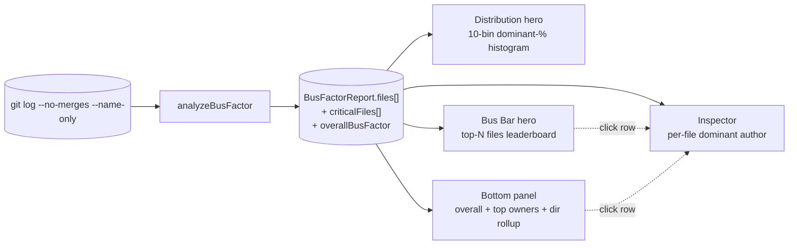

# Bus Factor

**Bus Factor** measures ownership concentration across a repository's files. The classic phrasing — *"how many people would have to get hit by a bus before knowledge of this codebase collapses?"* — is morbid, but the underlying question is real: every file has a dominant author, and when one person owns the bulk of the commits to many critical files, the codebase has a single point of failure that no test suite, lint rule, or CI pipeline can catch.

The Bus Factor analyzer answers two related questions:

- **"Which files are dangerously owned by a single author?"**
- **"Who would knowledge collapse on if they got hit by a bus?"**

Why this matters: ownership concentration is silent until it isn't. A file with one dominant author at 100% looks identical in `git status` to a file with five well-distributed contributors — both compile, both pass tests, both ship. The risk only surfaces during onboarding, code review, or the day the dominant author takes vacation. Surfacing the concentration *before* one of those moments is the entire point of this analyzer.

::: tip Screenshot
**TODO:** Capture the Bus Factor analyzer view (sidebar selection, `Distribution` hero default tab, `Bus Bar` alt tab, bottom-panel narrative-KPI with "where they live" extras, right-side Inspector populated). Save to `apps/docs/public/images/analyzers/bus-factor-overview.png`, then replace this callout with ``.
:::

## Quick read

If you only have ten seconds:

- **Top of the screen** (`Distribution` hero, default tab) — 10-bin histogram of dominant-author percent across the whole repo. Bar height is file count, color is ownership tier, and the ≥90% zone is shaded so the critical-ownership cluster is visible at a glance.
- **Top of the screen** (`Bus Bar` alt tab) — top-N files by ownership impact, drawn as horizontal bars. Bar length is dominant-author share, the row label shows the filename and the dominant author with their percent. The leaderboard view for "show me the worst files."
- **Bottom panel** (narrative KPI) — the repository's overall bus factor, the top-3 dominant owners across critical files (with their file counts and share), tier mix breakdown, and a "where they live" directory rollup.
- **Right-side Inspector** — click any file row in another analyzer's tab to see its bus factor (`N (author: NN%)`) alongside hotspot, churn, rewrite, age, and the rest.

## How bus factor is measured

The full pipeline, from raw git output to the dashboard surfaces:



For each commit, the analyzer credits the commit's author against every tracked file the commit touched. After processing every commit, each tracked file has:

- **`uniqueAuthors`** — the count of distinct author email addresses that have touched the file.
- **`authors`** — the full list of those email addresses, sorted by commit count desc.
- **`dominantAuthor`** — the author with the most commits to this file.
- **`dominantAuthorPercent`** — that dominant author's commit count as a percent of the file's total commits, rounded to the nearest integer.
- **`risk`** — a tier enum (`critical` / `high` / `medium` / `low`) derived from the two numbers above.

A few specifics worth knowing:

- **Window:** the full reachable history of the analyzed branch, bounded by `--since=<date>` if provided.
- **Merge commits are excluded** (`--no-merges`). Merge commits don't represent authorship of file content; including them would inflate the merger's apparent ownership.
- **Only currently-tracked files are scored.** Files deleted before scan time are filtered out via `git ls-files`.
- **Renames are *not* followed.** A file's pre-rename ownership history is attributed to its old path. The [Rename Tracking](/analyzers/renames) analyzer reconstructs continuity when needed.
- **Author identity is by email.** Two commits from `dan@old-job.com` and `dan@new-job.com` count as two different people. A `.mailmap` file in the repo is honored if present.

## The risk formula

For each file, the analyzer assigns a risk tier:

```
if (uniqueAuthors === 1 || dominantAuthorPercent >= 90)  → critical
else if (dominantAuthorPercent >= 75)                    → high
else if (dominantAuthorPercent >= 50)                    → medium
else                                                     → low
```

Two thresholds, four tiers. The `uniqueAuthors === 1` branch is a defensive carve-out — a file with a single ever-author always has `dominantAuthorPercent === 100`, so it would already land in the critical band — but the explicit check keeps the intent visible: a single-author file is the unambiguous "single point of failure" case.

The repository-level **`overallBusFactor`** is computed across the top-20 files sorted by ownership concentration:

```
overallBusFactor = min(uniqueAuthors across the 20 most concentrated files)
```

This is the literal "bus factor" of the repo — the smallest number of people whose departure would erase exclusive ownership of the most concentrated files. A `1` means at least one of the top-20 has a single author; the codebase has a true single point of failure. A `4` or higher means concentration is broad enough that no individual departure can collapse ownership across that group.

### The four tiers

| Tier | Threshold | Meaning |
|---|---|---|
| **low** | < 50% dominant | Knowledge is well distributed across multiple contributors. |
| **medium** | 50–74% dominant | One contributor has a clear plurality. Healthy for active codebases. |
| **high** | 75–89% dominant | One contributor holds three quarters or more. Worth pairing review. |
| **critical** | ≥ 90% dominant *or* single-author | Effectively single-owned. Onboarding risk. |

The narrative-KPI's headline number uses the **`overallBusFactor`** integer, not the per-file tier — it answers a different question (*"how many people protect the codebase?"*) than the histogram (*"what's the shape of concentration?"*) or the leaderboard (*"which files specifically?"*).

## Reading the surfaces

### The hero — `Distribution` (default tab)

A 10-bin histogram of `dominantAuthorPercent` across all analyzed files, bucketed in widths of 10 (0–9, 10–19, …, 90–100). Bars are colored by the tier of the bucket's midpoint, and the right side of the chart is shaded to mark the **critical-ownership threshold** (`≥90%`) — the same threshold the analyzer's `risk === 'critical'` band uses, snapped cleanly to the last bucket boundary so the visual, the tier, and the panel agree.

The hero answers **"what's the shape of ownership concentration across the repo?"** Three shapes, three different stories:

- **Right-skewed with a giant 90+ bar** — the saturation pathology. A large fraction of the repo is single-author. Common on solo or recently-launched projects, on auto-generated subtrees (fixtures, snapshots, generated docs), and on codebases where one author has been dominant for a long time. Triage by reading the bottom panel's "Top dominant owners" — if one person holds the majority of the bar, that's your bus-factor target.
- **Bimodal** — a hump in the low-medium range and a smaller hump at 90+. The codebase has a clear mix of well-shared files and single-owned ones. The single-owned cluster is usually a specific subsystem; the directory rollup in the bottom panel tells you which.
- **Left-skewed long tail** — most files are well-shared, with a small high-percent tail. Healthiest distribution. The analyzer is doing its job by surfacing the few outliers; the headline `overallBusFactor` should be ≥4.

A note on the shape on auto-generated subtrees: fixture-heavy or snapshot-heavy directories often inflate the 90+ bar regardless of how the rest of the codebase is owned. Read the directory rollup to identify if the saturation is "real" code or generated artifacts before drawing conclusions.

### The hero — `Bus Bar` (alt tab)

A horizontal bar leaderboard of files by ownership impact. Each row shows:

- **Filename** (basename + parent path).
- **Bar length** — the dominant author's percent share of the file's commits, scaled 0–100%.
- **Right-side annotation** — the dominant author's email and percent.
- **Bar color** — the file's `risk` tier.

The hero answers **"which files specifically are dangerously owned, and by whom?"** Sorted by impact (a composite of ownership share and file activity), so the top of the chart is "the files where the bus factor *matters most*" rather than "the files with the highest percent" (since dozens of fixtures might tie at 100%).

A few shapes worth recognizing:

- **All bars at 100% red** — the saturation pathology, surfaced one row at a time. Cross-reference with the directory rollup in the bottom panel; if all the saturated files share a parent (e.g., `fixtures/`, `__snapshots__/`), that's reassuring. If they're scattered across `src/` and core packages, that's a real ownership emergency.
- **Mixed colors descending** — the leaderboard cleanly orders critical (red) → high (orange) → medium (yellow) → low (green) files. The healthy shape: each tier visible, the danger zone clearly bounded.
- **One dominant author across many bars** — the same email recurs in the right-side annotations. Cross-reference with the bottom panel's "Top dominant owners" to confirm the headline.

### The bottom panel — narrative KPI

A single panel, not a table. The left-side big number is **`overallBusFactor`** — the canonical bus-factor integer for the repository — badge-colored by severity:

| Tier | `overallBusFactor` | Badge |
|---|---|---|
| **No Data** | 0 (empty repo) | neutral |
| **Critical** | 1 | critical |
| **High Risk** | 2–3 | warning |
| **Resilient** | ≥ 4 | healthy |

The thresholds are anchored on the canonical bus-factor definition. A single-person dependency is *always* critical regardless of repo size; two or three is risky on most teams; four-plus generally means no individual departure collapses ownership across the most concentrated group.

The right side carries three pieces of context:

1. **Top dominant owners** — the three authors who hold the most critical files, with their file count and share of the critical set. *This is the answer to "who would knowledge collapse on?"* — surfaced directly in the headline rather than buried in the leaderboard. On real repos, the same author often dominates many of the worst files; the file-centric framing would have repeated the same name across three rows, while the author-centric framing surfaces three distinct people whose departure each carries weight.
2. **Tier mix subline** — the count of files in each risk tier (`critical / high / medium / low`). Answers the "is the saturation broad or narrow?" question that the histogram shows visually but the headline integer can't.
3. **"Where they live" rollup** — directory-level breakdown of the *critical* files. Each row shows the immediate parent directory, the count of critical files inside it, the share of the repo's total critical count, and a small bar visualizing that count relative to the largest directory. Top 5 directories, sorted by count desc with alphabetical tiebreak. When more than 5 distinct directories hold critical files, the rollup ends with a `+ N more directories` line.

Why a KPI and not a table: the Distribution hero shows the shape, the Bus Bar hero shows the specific files, the Inspector shows full per-file detail on click. The aggregate bus factor, the *who* behind the saturation, the tier mix, and the directory rollup are the questions none of those other surfaces answer. A sortable file table on the bottom would have been a worse version of the Bus Bar hero.

The sticky **See also** footer links to two related analyzers:

- **[Knowledge Silos](/analyzers/knowledge-silos)** — the same ownership-concentration question, asked across the entire repo (not just the top-20). Where Bus Factor surfaces "the worst files," Knowledge Silos surfaces "the codebase-wide ratio of single-author files."
- **[Ghost Files](/analyzers/ghost-files)** — a related risk: files owned by an author who has *already* left the project. Bus Factor finds future risk; Ghost Files finds risk that has already materialized.

### The right-side Inspector

Click any file row in another analyzer's tab and the Inspector populates with that file's full per-file profile, including `Bus Factor` rendered as `N (author: NN%)` — where `N` is the file's `uniqueAuthors` and the parenthetical names the dominant author with their percent share. The Inspector is the place to drill into a single file; the bottom panel and the Bus Bar are the places to scan many files at once.

## What action it suggests

Bus Factor is a triage signal, not an indictment. A few patterns to act on:

- **`overallBusFactor === 1` with a single name in "Top dominant owners"** — the most common "real" bus-factor situation. The named author should be paired on every change to the critical files, and review responsibility should be deliberately rotated to a second person on those paths.
- **Saturation pathology that's all in `fixtures/` or `__snapshots__/`** — usually safe to ignore on the engineering-risk axis. Generated content has no "knowledge" to lose; the dominant author here is whoever last regenerated the files.
- **High-tier file overlap with [Hotspots](/analyzers/hotspots)** — a critical-bus-factor file that's also a hotspot is the worst combination: actively churning code with no one besides the dominant author who knows it well. These are the files that should drive pair programming and explicit review-rotation policies.
- **High-tier overlap with [Rewrite Ratio](/analyzers/rewrite-ratio)** — a critical-bus-factor file that also keeps thrashing in place is a sign that the dominant author is iterating without enough review pressure. Expand reviewer scope or pair before the next refactor.
- **Top dominant owner is a bot** (`semantic-release-bot`, `dependabot[bot]`, etc.) — usually not a real bus-factor risk; the bot is just a stand-in for "automated commits that touch many files." Sanity check by reading the file list — if they're all `package.json`, `CHANGELOG.md`, or lockfiles, ignore.

## Limitations

- **Identity, not knowledge.** The analyzer measures *who committed*, not *who understands*. Two commits from the same email count as the same author even if the actual domain expertise has rotated. Read the leaderboard alongside team knowledge — a name that hasn't been on the team in two years is still credited as the dominant author.
- **Email-based identity.** A contributor who switches email addresses (job change, GitHub no-reply, multiple devices) appears as multiple authors. Configure a `.mailmap` to merge identities; the analyzer honors it via `git log`.
- **Generated content inflates concentration.** Auto-regenerated files (snapshots, fixtures, lockfiles, migrations) accumulate "ownership" by whoever ran the regeneration last. Common saturation pathology that the analyzer can't disambiguate from real engineering ownership without external context.
- **`overallBusFactor` is a top-20 metric.** The repo-level number is computed across the 20 most-concentrated files, so it doesn't reflect the long tail. A repo with `overallBusFactor === 4` can still have many single-owned files outside the top-20 — read the histogram and the directory rollup for the broader view.
- **Renames break continuity.** A file's ownership history is attributed to its current path; pre-rename commits are credited against the old path. See [Rename Tracking](/analyzers/renames).
- **Pre-1.0.** The risk thresholds, the top-20 window for `overallBusFactor`, and the tier definitions may change. See [CHANGELOG](https://github.com/nebulord-dev/gitrelic/blob/main/CHANGELOG.md) for shifts.

## Related analyzers

- **[Knowledge Silos](/analyzers/knowledge-silos)** — same ownership-concentration question at the codebase level. Bus Factor names the worst-affected files; Knowledge Silos summarizes the codebase-wide ratio.
- **[Ghost Files](/analyzers/ghost-files)** — files whose dominant author has already left active contribution. The risk Bus Factor predicts; Ghost Files reports it after it's happened.
- **[Contributors](/analyzers/contributors)** — per-author profiles. The "Top dominant owners" in this panel link conceptually to Contributors entries; click through for that author's full profile.
- **[Hotspots](/analyzers/hotspots)** — churn × LOC composite. A bus-factor-critical file that's also a hotspot is the worst kind of file: actively changing, complex, *and* under-witnessed.
- **[Cursed Files](/analyzers/cursed-files)** — multi-dimensional risk score that incorporates bus factor as one of its inputs. A file flagged by Cursed Files frequently overlaps with this analyzer's critical tier.
- **[Web Dashboard](/dashboard/)** — the rendering layer that hosts the Distribution / Bus Bar heroes and the narrative-KPI bottom panel.
