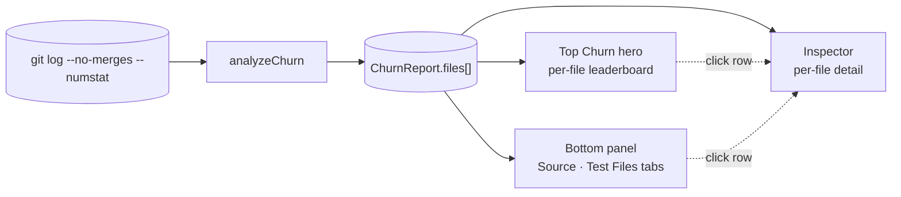

# Churn

**Churn** is the number of commits that touched a given file within the analysis window. It's a proxy for instability — files with high churn are either under active development, structurally fragile, or both. The analyzer ranks every tracked file by this count and rolls the data up by directory so you can spot both single-file hotspots *and* whole areas of the codebase that won't sit still.

The Churn analyzer answers two questions on the same screen:

- **"Which individual files are touched the most?"** — the per-file leaderboard.
- **"Where in the codebase does churn cluster?"** — the per-directory roll-up.

The two questions look similar but pull apart in practice: a hot single file can sit inside an otherwise stable directory, and a churning directory can have no individually-hot file (just lots of medium churn). Both signals matter, neither subsumes the other.

::: tip Screenshot
**TODO:** Capture the Churn analyzer view (sidebar selection, `Top Churn` hero bar, bottom-panel `Churn` and `Test Files` tabs, right-side Inspector populated). Save to `apps/docs/public/images/analyzers/churn-overview.png`, then replace this callout with ``.
:::

## Quick read

If you only have ten seconds:

- **Top of the screen** (`Top Churn` bar) — the most-modified individual files, ranked.
- **Bottom panel** (`Churn` tab) — the same data rolled up by directory. Switch to **`Test Files`** to isolate test churn from source churn.
- **Right-side Inspector** — click any file row to see its full per-file detail (LOC, authors, age, hotspot score, etc.).

## How churn is measured

The full pipeline, from raw git output to the three dashboard surfaces:

The analyzer's job ends at `ChurnReport.files[]` — everything to the left is `analyzeChurn`'s logic, everything to the right is dashboard rendering. This section documents the analyzer's side; see [Reading the surfaces](#reading-the-surfaces) for the rendering side.

The runner calls `git log --format=… --numstat --no-merges` for the analyzed branch, parses each commit's changed-file list, and counts how many commits each file appears in. That count becomes `commitCount` in the report and feeds every surface on the page.

A few specifics worth knowing:

- **Window**: by default the full reachable history of the analyzed branch. The CLI's `--since=<date>` flag bounds it (e.g. `--since=2026-01-01` for "this year only"). The bottom-of-the-page summary tells you what window applied.
- **Merge commits are excluded** (`--no-merges`). A merge that touches 50 files doesn't inflate any file's churn — only the original commits on the merged branches count.
- **Renames are *not* followed.** Without `--follow`, git treats a rename as "old file deleted, new file created" — so a file's `commitCount` reflects only commits made under its current name. Pre-rename history is attributed to the old path. The [Rename Tracking](/analyzers/renames) analyzer surfaces these chains explicitly when you need to reconstruct continuity.
- **Only currently-tracked files appear in the rollup.** Files that were deleted before scan time aren't in `git ls-files`, so they're filtered out — even if their old commits are still in the log. They live in the raw `report.commits` array but don't surface in the analyzer's output.

## The four categories

Each file gets a `churnScore` from 0–100, normalized against the repo's hottest file (top file = 100). The score buckets into four categories:

| Category | Score | Meaning |
|---|---|---|
| **hot** | ≥ 76 | Top tier — concentrated change. Likely under active development or unstable. |
| **warm** | 41–75 | Above the median. Active areas. |
| **cold** | 11–40 | Below the median. Edited periodically. |
| **frozen** | ≤ 10 | Rarely or never touched in the window. Stable, abandoned, or both. |

The hero bar color-codes each row by category. The legend strip below the bars shows the thresholds.

Because the score is *relative* (top file = 100), categories are calibrated per repo. A "hot" file in a mature, slow-moving codebase might have fewer raw commits than a "warm" file in a fast-moving one. Compare across repos with caution.

## Reading the surfaces

### The hero — `Top Churn`

A horizontal bar chart of the top 100 files by `commitCount`, ranked descending with ties broken by file path. Each bar is colored by churn category and labeled with the file's basename on the left and its commit count on the right.

The hero answers **"Which single files are touched the most?"** — a per-file leaderboard.

What it doesn't tell you: where in the directory tree those files cluster, or how large the long tail is (the 2,000+ files that didn't make the top 100). Those questions belong to the bottom panel and the metrics strip respectively.

### The bottom panel — `Churn` and `Test Files` tabs

Two tabs sharing one component, both showing a **directory roll-up**: every file's parent directory is grouped together, commit counts are summed, and the most-churned file in each directory is surfaced as an anchor.

| Column | What it shows |
|---|---|
| **Directory** | Parent directory path (e.g. `packages/react-reconciler/src`). Files at the repo root render as `(root)`. |
| **Commits** | Sum of `commitCount` across all files in the directory. |
| **Share** | The directory's commits as a fraction of all commits in the current view. Sums to ~100% across all directories within a tab (see [The two "Share" denominators](#the-two-share-denominators) below). |
| **Files** | Number of files in the directory. |
| **Top file** | Basename of the most-churned file in the directory — anchor for what's driving the row. |

The default sort is **Commits** descending, set at the aggregator boundary. You can re-sort by `Commits`, `Share`, or `Files` interactively by clicking the header. `Directory` and `Top file` are not sortable — they're labels, not metrics.

The top-10 cap is fixed at the source: re-sorting `Share` desc gives you "the top 10 by commits, *displayed* by share desc" — not "the top 10 by share." This is intentional. Capping at the source means you always see the same cohort of directories, just re-arranged. Capping at the sort would change the cohort on every click and make the table feel volatile.

**Why the Source / Test Files split:** test-heavy repos drown out the source story when conflated. React's `__tests__/fixtures/compiler` directory absorbs 24% of total churn — meaningful, but it pushed `react-reconciler/src` and `react-server/src` out of the top spots when both lived in one tab. Splitting preserves both signals; click whichever lens matters to your question.

### The right-side Inspector

Click any file row (in this analyzer's hero, or any other analyzer's tab that surfaces this file) and the Inspector populates with that file's full per-file profile: hotspot score, LOC, language, bus factor, age, blast radius, coupling, curse score, rewrite ratio, shame score, churn trend, and top contributors.

The Inspector is the **per-file detail surface**. The bottom-panel rollup intentionally omits per-file detail because it would just rotate the hero — and rotation isn't insight.

## File rank vs directory rank

The hero and the bottom-panel rollup show the **same data** at **different units of analysis**. A file's hero rank does not predict its directory's table rank, and that's the whole point.

Concrete React example:

- **Hero #1**: `renderer.js` — 98 commits. Lives in `packages/react-devtools-shared/src/backend/fiber/`, which has only that one file. Directory commits = 98.
- **Table #1**: `packages/shared/forks` — 283 commits across 8 files. None of those 8 files individually rank near the top of the hero.

The hero spots **single-file hotspots**. The table spots **collectively unstable areas**. A hotspot file can sit inside a directory that's otherwise stable; a churning directory can have no individually-hot file (just lots of medium churn). Both signals matter, neither subsumes the other — and that's why both share the screen.

## The two "Share" denominators

The metrics strip at the top shows `TOP FILE SHARE` (e.g. `8.5%`). The bottom-panel table shows a `Share` column (e.g. `6.5%` for the top directory). **These don't use the same denominator**, and the difference is deliberate.

| Surface | Numerator | Denominator | Question it answers |
|---|---|---|---|
| Strip | Top file's `commitCount` | Total unique repo commits | How dominant is the single hottest file? |
| Table | Directory's commit-sum | Sum of `commitCount` across all files in this view | What fraction of *churn* lives in this directory? |

These differ because **one commit can touch multiple files**. If 100 commits each touch 5 files, total unique commits = 100 but total commit-touches = 500. The strip's percentage is "share of unique commits"; the table's is "share of churn." Each is the right denominator for its question, but they're not directly comparable.

If you flip between the two without holding the distinction in mind, the percentages will look incomparable — because they are.

## What counts as a test file?

The Churn analyzer treats a path as a test file if **any** of these match:

- A directory segment equals `__tests__`, `__snapshots__`, `__fixtures__`, `tests`, or `cypress`.
- The basename matches the pattern `.test.` or `.spec.` (e.g. `Foo.test.ts`, `bar.spec.tsx`).

Singular `test/` is intentionally **not** matched — it's too ambiguous (`latest/`, `contest/`, etc. trip false positives in some repos). Python's `tests/` directory is covered by the plural rule.

The classifier is conservative on purpose: snapshots, fixtures, and `cypress/` capture the dominant JavaScript-ecosystem conventions; everything else is treated as source. Future versions may surface this as a repo-level `testPaths` setting in a config file, applied uniformly across all analyzers — but for now it's a hardcoded heuristic local to the Churn web view.

## Related analyzers

- **[Hotspots](/analyzers/hotspots)** — `churn × LOC` composite. Where churn intersects with complexity, you get files that are both unstable *and* large enough to absorb maintenance cost. Hotspots are typically what you act on.
- **[Cursed Files](/analyzers/cursed-files)** — multi-dimensional risk score combining churn, ownership concentration, age anomalies, and coupling. Files at the intersection of "bad in many ways."
- **[Churn Velocity](/analyzers/churn-velocity)** — is the churn accelerating or decelerating over time? A hot file with decelerating churn is stabilizing; a hot file with accelerating churn is becoming a liability.

## Limitations

- **Counts commits, not LOC change.** A 1-line typo fix and a 1,000-line refactor each contribute one commit to the count. If you need volume-aware churn, see [Rewrite Ratio](/analyzers/rewrite-ratio).
- **Test classification is a heuristic, not configuration.** Files your team treats as tests but that don't match the patterns above will land in the source view. Repo-level config is on the roadmap.
- **Only currently-tracked files appear.** Files deleted before scan time are excluded from the rollup, even though their commits are still in the log.
- **Renames break continuity in the count.** A file's `commitCount` reflects only commits made under its current path. Use [Rename Tracking](/analyzers/renames) to reconstruct full lifecycles.
- **Pre-1.0.** Thresholds, classifiers, and column shapes may change. See [CHANGELOG](https://github.com/nebulord-dev/gitrelic/blob/main/CHANGELOG.md) for shifts.
