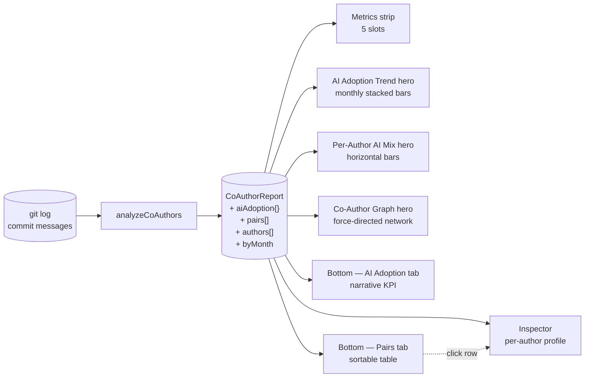

# Co-Authors / AI

The **Co-Authors / AI** analyzer parses `Co-Authored-By:` trailers from commit messages, classifies each author email as **AI** (Claude, GitHub Copilot, Aider, Devin, Cursor), **bot** (semantic-release, dependabot, renovate, GitHub Actions), or **human**, and surfaces two distinct stories: how AI assistance is adopted in this codebase, and which humans pair-program with each other.

The analyzer answers two related questions:

- **"Did we adopt AI assistance, when did it start, and who's using it?"** — the AI-adoption surfaces.
- **"Who pairs with whom on commits?"** — the human-collaboration surfaces.

Why both stories live in one analyzer: they share a single signal (`Co-Authored-By:` trailers in commit messages), but they answer entirely different questions. AI assistants generate a co-author trailer on every commit they help with, so AI usage shows up *densely*. Human pair-programming is voluntarily attributed and shows up *sparsely*. Splitting them across two analyzers would force the dashboard to read the same trailer twice and would lose the context that the same trailer can mean either story depending on which side of the AI/human partition it lands on.

A note on what this analyzer is *not*: it measures **explicit credit attribution**, not coordination. Two engineers can pair-program every day and never appear here if they don't add `Co-Authored-By:` trailers; conversely, an AI assistant gets a trailer-credit pair on every commit it helps with. For *observed* coordination — multiple authors editing the same file in the same week without explicit attribution — see the [Parallel Dev](/analyzers/parallel-dev) analyzer.

## Quick read

If you only have ten seconds:

- **Metrics strip** — five slots: `AI Adoption %` · `AI Commits` · `AI Authors` · `Human Pairs` · `Co-Author Commits`. The first slot is the headline; the remaining four give shape.
- **Top of the screen** (`AI Adoption Trend` hero, default tab) — monthly stacked bar: AI-assisted commits on top, pure-human commits on bottom. The temporal AI-adoption shape.
- **Top of the screen** (`Per-Author AI Mix` hero, alt tab) — horizontal bars, one per human, AI vs solo split. Shows who personally uses AI and at what ratio.
- **Top of the screen** (`Co-Author Graph` hero, alt-alt tab) — force-directed network of who-pairs-with-whom across the full co-author space (humans and AI).
- **Bottom panel** (`AI Adoption` tab, narrative KPI) — adoption %, top 3 AI users, ratio breakdown.
- **Bottom panel** (`Co-Author Pairs` tab, table) — sortable table of pairs with classification badges, file overlap, and pair-commit counts.

## How co-authors are measured

The full pipeline, from raw git output to the dashboard surfaces:

The analyzer iterates every commit, parses `Co-Authored-By: Name <email>` trailers from the commit body, and builds:

- A **per-email author classification** (`ai` / `bot` / `human`) using regex patterns over the email.
- A **per-month adoption rollup** counting AI-assisted commits vs pure-human commits.
- A **pair-frequency matrix** keyed by (author email, co-author email) with shared-file counts.

A few specifics worth knowing:

- **Trailer parsing.** Only the canonical `Co-Authored-By:` trailer (case-insensitive) is recognized. Other attribution conventions (`Signed-off-by:`, free-form "with help from X" text) are ignored.
- **Bots are stripped from the analysis.** Pairs and authors classified as bots are removed before any metric is computed. The bottom-panel tabs render a small footnote (`"N bot-authored commits filtered"`) when applicable, so the filter is transparent.
- **AI-assisted commit definition.** A commit is "AI-assisted" if at least one of its `Co-Authored-By:` trailers classifies as AI. Multiple AI co-authors on the same commit count as one AI-assisted commit.
- **The AI adoption %.** `aiAssistedCommits / (aiAssistedCommits + pureHumanCommits) × 100`. Bot-only commits (no human or AI co-author) are excluded from both numerator and denominator.
- **Renames are *not* followed** in the pair table's shared-file count. A pair's shared files are attributed to current paths only; pre-rename activity is counted against the old path.

## What counts as AI

| Tool | Email pattern |
|---|---|
| Claude (Anthropic) | `noreply@anthropic.com` |
| GitHub Copilot Workspace | `copilot[bot]@*.noreply.github.com` |
| Aider | `aider@aider.chat` |
| Devin (Cognition) | `devin-ai-integration[bot]@*.noreply.github.com` |
| Cursor | `*@cursor.sh` |

If your team uses an AI coding assistant that isn't on this list, please file an issue with the email pattern and we'll add it.

## What counts as a bot

`semantic-release-*`, `dependabot*`, `renovate*`, `github-actions[bot]@*`, plus a catch-all for `*[bot]@*.noreply.github.com` accounts that don't match an AI pattern.

Bots are stripped from the analysis entirely. They aren't ignored silently — the bottom-panel tabs surface a `"N bot-authored commits filtered"` footnote when bots were present in the raw data, so the filter is auditable rather than invisible.

## The metrics strip

Five KPI slots appear at the top of the Co-Authors pane.

### AI Adoption %

`aiAssistedCommits / (aiAssistedCommits + pureHumanCommits) × 100`, rounded to the nearest integer.

| Value | Tier | Meaning |
|---|---|---|
| No co-author trailers anywhere | `No Co-Author Data` (neutral grey) | Most repos in the wild. The signal isn't applicable. |
| 0% (trailers present, none AI) | `No Adoption Yet` (neutral, not red) | Human-only attribution. *Absence of AI is not a risk.* |
| 1–19% | `Low Adoption` | AI is being tried, not embedded. |
| 20–49% | `Moderate Adoption` | AI is meaningfully part of the workflow. |
| ≥ 50% | `High Adoption` | AI is the default for most commits. |

**The tier ladder is intentionally neutral.** Other analyzers map to `healthy / warning / critical` because their underlying metric encodes risk. AI adoption is not a risk axis — it's a workflow-shape signal — so the tiers describe the *shape*, not the *quality*. A repo with `0%` adoption is not red; a repo with `80%` adoption is not green. The team decides which shape it wants.

### AI Commits

The absolute count of AI-assisted commits. Useful in combination with the headline % — a 30% adoption ratio across 10 commits is a different signal than 30% across 1,000.

### AI Authors

The count of distinct human authors with at least one AI-assisted commit. Tracks individual adoption breadth, separate from volume.

### Human Pairs

The count of distinct (human, human) pairs with one or more co-authored commits. Bots and AI tools are excluded from this count by definition; this slot answers the human-pair-programming question directly.

### Co-Author Commits

The total count of commits with any non-bot `Co-Authored-By:` trailer. The denominator behind every other slot — present so the strip can be read at a glance without context-switching.

## Reading the surfaces

### The hero — `AI Adoption Trend` (default tab)

A monthly stacked bar chart. Each bar is one ISO calendar month in the analysis window. Top layer = AI-assisted commits; bottom layer = pure-human commits. The bars sum to total human-authored commits per month (bot-only commits are excluded from both layers).

The hero answers **"did we adopt AI, and is the use trend growing?"** Three shapes worth recognizing:

- **Hockey stick** — the team adopted AI in a specific month and the share has grown since. The exact start month is usually visible at a glance and is often the most useful piece of information in the analyzer.
- **Steady ratio** — consistent AI use over time. The team integrated AI assistance early in the analysis window and has held the ratio steady.
- **Empty top layer** — no AI assistance in this codebase yet. The bars are still informative as a pure-human commit rhythm, but the AI-adoption story is "not yet."
- **No bars at all** — no co-authored commits anywhere in the window. Common on solo or pre-AI-era repos. The metrics strip's `AI Adoption %` slot will read `—` and the tier badge will be `No Co-Author Data`.

### The hero — `Per-Author AI Mix` (alt tab)

A horizontal bar chart, one row per human author. Each row is split: the colored segment is the author's AI-assisted commits; the neutral segment is their solo commits. Trailing `N%` is their personal AI ratio.

The hero answers **"who personally uses AI most?"** The chart shows the top-20 humans by total commits unioned with all humans with any AI use, capped at 30 rows. Sorted descending by personal ratio.

A few shapes worth recognizing:

- **One or two long colored bars at the top, rest neutral** — a small group of AI champions ahead of the rest of the team. Common in early-adoption phases.
- **Most rows partially colored** — broad AI uptake; the team has integrated it across the bulk of contributors.
- **All rows neutral** — the row exists because the contributor pair-programmed with another human, not with AI. The chart still surfaces them; the colored segment is just zero.

### The hero — `Co-Author Graph` (alt-alt tab)

A force-directed network of co-authorship across the full co-author space. Each circle is a co-author email; each edge is a pair connection. Circle size encodes co-commit volume; edge thickness encodes pair frequency.

The hero answers **"who pairs with whom, and what does the collaboration topology look like?"** Three shapes worth recognizing:

- **Star pattern centered on Claude / Copilot** — AI-dominant team. Most co-authoring goes through an AI assistant; human-human edges are sparse around the AI hub.
- **Dense human cluster** — active pair-programming culture. Humans are connected to many other humans by direct edges with no AI hub in between.
- **Sparse, fragmented graph** — little explicit collaboration credit. A few isolated dyads, no community structure. May reflect a real lack of coordination or simply a team that doesn't use trailers.

Single-commit edges are hidden by default to reduce visual noise (the hidden-edge count is shown in the chart caption). Bot nodes are stripped before rendering, so the topology you see is human-and-AI only.

### The bottom panel — `AI Adoption` tab (narrative KPI)

A single panel, not a table. The left-side big number is the **AI Adoption %** — the same metric as the strip's first slot, repeated at narrative scale because this is the headline question the bottom panel exists to answer. Badge color tracks the same tier ladder as the strip (`No Co-Author Data` / `No Adoption Yet` / `Low / Moderate / High Adoption`).

The right side carries three pieces of context:

1. **Top 3 AI users** — the three humans with the highest absolute AI-assisted commit counts, with their ratios. The answer to "who's the team's AI champion?"
2. **Ratio breakdown subline** — `X AI-assisted · Y pure-human · Z bot-filtered` — the raw counts behind the headline percent, so the percentage is auditable at a glance.
3. **Top AI tools used** — the AI tools (Claude / Copilot / etc.) ranked by commit count. Shown only when more than one AI tool appears; suppressed for single-tool repos to avoid a one-row "list."

### The bottom panel — `Co-Author Pairs` tab (table)

A sortable table of pairs, one row per (author, co-author) pair after bot filtering. Columns: pair label (with classification badges — `[AI]` for AI pairs, `[Human]` for human pairs), pair commits, shared file count, last collaboration date.

The table answers **"which specific pairs work together, and how much overlap do they have?"** The classification badges are critical context: a high pair-commit count with an `[AI]` badge means the human author leans on that AI tool a lot; the same count with a `[Human]` badge means real pair programming. Without the badges, the two stories would be indistinguishable in the table.

The footer surfaces the bot-filter footnote (`"N bot-authored commits filtered"`) when applicable, so the table can be trusted as a complete view of human + AI collaboration.

### The right-side Inspector

Click any row in the pairs table to populate the Inspector with the author's full profile: total commits, AI-assisted commit count, AI ratio, top co-author partners, classification (`ai` / `human`). The Inspector is the place to drill into a single contributor's collaboration shape; the bottom panels and heroes are the places to scan many at once.

## AI Adoption vs Human Pairs

The analyzer is deliberately bi-modal — different surfaces answer different questions. The matrix below maps questions to surfaces.

| Question | Surface |
|---|---|
| Did we adopt AI? When? | `AI Adoption Trend` hero (default) + strip slot 1 |
| Who personally uses AI most? | `Per-Author AI Mix` hero (alt) + strip slot 3 |
| Who pairs with whom? | `Co-Author Graph` hero (alt-alt) + `Co-Author Pairs` table tab |

## Three repo modes

The analyzer handles three structurally different states. Recognizing which mode applies to your repo is usually the first read.

### Scenario 1 — no co-author trailers anywhere

Most repos in the wild fall here. The big number reads `—`; tier badge is `No Co-Author Data` (neutral grey). The trend hero shows an empty-state placeholder; the pair table is empty. The analyzer is reporting "no signal" rather than "zero adoption" — those are different states and the dashboard distinguishes them.

### Scenario 2 — trailers present, zero AI

The classic human-pairing repo (e.g., a long-running open-source project with a strong pair-programming culture). Big number reads `0%`; tier badge is `No Adoption Yet` (neutral, *not* red — absence of AI isn't risk). Trend hero renders with rich pure-human bars; the pair table shows all `[Human]` rows. The Co-Author Graph hero often shows a dense human cluster.

### Scenario 3 — AI-using repo

Big number shows the adoption %; tier badge maps to `Low / Moderate / High Adoption`. The trend hero shows the temporal AI-adoption shape (often a hockey stick somewhere in the window). The pair table mixes `[AI]` and `[Human]` rows. The graph hero often shows a star pattern centered on the AI hub.

## What action it suggests

Co-Authors is a workflow-shape signal, not a risk indictment. A few patterns worth acting on:

- **`No Adoption Yet` with an active pair-programming culture** — nothing to do. The team has chosen its collaboration mode and the analyzer is correctly reporting it.
- **Hockey stick adoption with a single dominant AI user** — early adoption phase. The Top-3 AI users panel will show a single name carrying the bulk of adoption. Consider whether the rest of the team should be onboarded to the same workflow, or whether the dominant user is an outlier (e.g., a single person experimenting).
- **High AI adoption + sparse human-human edges in the graph** — the team has substituted AI assistance for human pair programming. Not inherently bad, but worth knowing — the [Parallel Dev](/analyzers/parallel-dev) analyzer is a complementary view of *implicit* concurrent work, and gaps in human-human pairing here often correlate with elevated parallel-dev pressure there.
- **Large `bot-authored commits filtered` footnote** — purely informational. Bots aren't a problem; the footnote exists so you know the filter ran. Worth a glance when the bot count is unexpectedly large (e.g., a release-bot misconfiguration that's flooding the log).

## Limitations

- **Heuristic AI-tool detection.** New AI tools may not yet be classified — the patterns are explicit string matches, not behavioral inference. File an issue or PR to add patterns when you hit one.
- **Trailer-only signal.** Some teams pair-program religiously but don't use `Co-Authored-By:` trailers; their collaboration is invisible here. The [Parallel Dev](/analyzers/parallel-dev) analyzer complements this with observed concurrent work.
- **Squash merges may drop trailers.** GitHub's squash-merge UI can preserve or strip co-author trailers depending on the repository's configuration. A repo where trailers are routinely stripped during merge will under-report AI and human pairing alike.
- **Renames are not followed.** The pair-graph counts shared files based on file path; rename history isn't followed. See [Rename Tracking](/analyzers/renames).
- **Credit ≠ coordination.** A commit with `Co-Authored-By: Claude` doesn't necessarily mean "Claude wrote this code" — it means the human author chose to attribute AI help. The signal reflects attribution behavior, not authorship reality.
- **Pre-1.0.** The AI/bot pattern lists, the adoption-tier thresholds, and the single-commit-edge hiding default may change. See [CHANGELOG](https://github.com/nebulord-dev/gitrelic/blob/main/CHANGELOG.md) for shifts.

## Related analyzers

- **[Contributors](/analyzers/contributors)** — per-author totals across the whole repo. Co-Authors is a *collaboration* lens; Contributors is a *who-works-on-this* lens. Both key on email but answer different questions.
- **[Parallel Dev](/analyzers/parallel-dev)** — concurrent file-level work without explicit attribution. Co-Authors is the *attributed* collaboration sibling to Parallel Dev's *observed* one. A team with low Co-Author signal but high Parallel Dev signal is collaborating implicitly; the inverse means collaboration is happening but it's heavily AI-mediated.
- **[Bus Factor](/analyzers/bus-factor)** — ownership concentration per file. Relevant when AI adoption changes the team's ownership shape — e.g., a single human author plus an AI co-author per commit can produce ownership patterns that look concentrated in Bus Factor terms even though the work was assistive.
- **[Web Dashboard](/dashboard/)** — the rendering layer that hosts the AI Adoption Trend / Per-Author AI Mix / Co-Author Graph heroes and the AI Adoption + Co-Author Pairs bottom-panel tabs.
