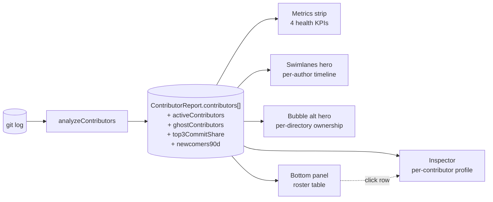

# Contributors

**Contributors** measures per-author commit activity across the full repository history. It aggregates raw git output into author profiles — commit counts, file ownership, lines changed, first and last commit dates, and the two or three directories where each author does most of their work. The result is a team roster grounded in actual commit behavior rather than org-chart membership.

The analyzer answers three questions:

- **"Who's on the team, and who is still actively contributing?"** — the active/ghost classification distinguishes current team members from dormant past contributors.
- **"Where is velocity concentrated?"** — the Top-3 Share metric surfaces whether a small group of authors drives the bulk of commits, which correlates with both bus-factor risk and burnout risk.
- **"Is the team growing or stagnating?"** — the Newcomers (90d) count tracks onboarding momentum as a team-renewal signal.

The framing is deliberately social and team-visibility oriented rather than purely forensic. A manager reviewing sprint load, a tech lead assessing knowledge spread, and a developer onboarding to a new codebase all use these surfaces differently — but the underlying numbers serve all three.

::: tip Screenshot
**TODO:** Capture the Contributors analyzer view (sidebar selection, `Swimlanes` hero default tab, `Ownership` alt tab, bottom-panel roster table, right-side Inspector populated with a contributor profile). Save to `apps/docs/public/images/analyzers/contributors-overview.png`, then replace this callout with ``.
:::

## Quick read

If you only have ten seconds:

- **Top of the screen** (`Swimlanes` hero, default tab) — per-author commit timeline, one lane per contributor, with activity density rendered as colored bars. Gaps in a lane mean no commits that week; color intensity reflects commit volume.
- **Top of the screen** (`Ownership` alt tab) — per-directory ownership bubble chart, sized by commit count and colored by author. Shows where in the codebase each author concentrates their work.
- **Bottom panel** (roster table) — the full contributor list sortable by commits, files owned, lines changed, and last active date. Ghost authors are tagged with a badge; focus areas appear as a compact directory list per row.
- **Right-side Inspector** — click any contributor row to see their full profile (commit count, files owned, lines changed, first/last commit, focus areas).

## How contributors are measured

The full pipeline, from raw git output to the dashboard surfaces:

The analyzer iterates every commit in the analysis window and builds a per-email author map. A few specifics worth knowing:

- **Identity:** keyed by `commit.authorEmail`. Two email addresses with the same display name are treated as two distinct contributors. No name-collision dedup or `.mailmap` resolution happens at this layer.
- **Active vs ghost cutoffs:** The active window is `max(90, round(repoAgeDays × 0.25))` days before now; the ghost window is `max(180, round(repoAgeDays × 0.5))` days before now. On a 1-year repo (365 days), active = last 91 days, ghost = past 183 days. A contributor is **active** if their last commit falls within the active window; a contributor is a **ghost** if they are not active and their last commit falls before the ghost cutoff. The zone between the two cutoffs is neither active nor ghost — former contributors who may return.
- **Focus areas:** the top three directories per author by commit count. Directory depth is fixed at 2 (e.g. `packages/react-dom`, not just `packages/`). Files at the repo root (no `/`) map to `.`.
- **Newcomers (90d):** count of contributors whose `firstCommit` is within the last 90 days. The boundary is inclusive — a commit exactly 90 days old counts.
- **Top-3 Share:** `(top-3 contributor commit sum) / total commits × 100`. Measures velocity concentration across people, not per-file ownership. Distinct from [Bus Factor](/analyzers/bus-factor), which measures the same concentration per file.
- **Files owned:** populated by the runner after the bus-factor analysis runs; the contributors analyzer itself returns `0` as a placeholder. By the time the dashboard renders, the field is filled.

## The metrics strip

Four KPI slots appear at the top of the Contributors pane. Each is colored by severity tier.

### Active Contributors

Count of contributors whose last commit falls within the active window (see cutoffs above).

| Value | Tier | Color |
|---|---|---|
| 0 | Critical | Red |
| 1 | Critical | Red |
| 2–5 | Warning | Amber |
| 6+ | Healthy | Green |

Zero active contributors means no one has committed within the active window — typically a stale repository or an analysis window that excluded the recent contributor base. A single-author project is also flagged critical because the entire commit bus has one driver. Five or fewer active contributors is a warning because the knowledge surface is narrow enough that two or three simultaneous departures could stall delivery.

### Top-3 Share

`(top-3 contributor commit count sum) / total commits × 100`, rounded to the nearest integer.

| Value | Tier | Color |
|---|---|---|
| < 40% | Healthy | Green |
| 40–69% | Warning | Amber |
| ≥ 70% | Critical | Red |

High top-3 share means a small group accounts for the bulk of velocity. Useful in combination with the ghost and active counts: high share + no newcomers = concentrated velocity with no team renewal underway.

### Ghost Authors

Count of contributors who are neither active nor in the intermediate zone — their last commit predates the ghost cutoff.

| Value | Tier | Color |
|---|---|---|
| 0 | Healthy | Green |
| Ghost ratio < 30% | Warning | Amber |
| Ghost ratio ≥ 30% | Critical | Red |

The ratio is `ghostCount / contributors.length` — ghost count divided by **total all-time contributors** (active + intermediate + ghost). A small absolute ghost count on a large team is normal turnover; the same absolute count on a small team signals proportionally more dormant ownership and warrants cross-referencing with [Ghost Files](/analyzers/ghost-files).

### Newcomers (90d)

Count of contributors whose `firstCommit` falls within the last 90 days.

| Value | Tier | Color |
|---|---|---|
| 0 | Stale (neutral grey) | Tertiary text |
| 1+ | Healthy | Green |

Zero newcomers is a neutral observation, not a danger signal — a mature project that's complete and well-maintained may have no new contributors, and that's fine. The grey "stale" treatment keeps it from reading as a warning when no action is required. One or more newcomers renders green to flag that onboarding is happening.

## Reading the surfaces

### The hero — `Swimlanes` (default tab)

A per-author timeline with one horizontal lane per contributor, running from the earliest commit date to today. Each column represents one week; activity density within that week is rendered as a filled bar (or empty space for inactivity). Authors are sorted by total commit count descending — the most active contributor anchors the top lane.

The swimlanes answer **"who was active when, and are there collaboration windows where multiple authors overlap?"** Three shapes worth recognizing:

- **Dense overlapping lanes** — multiple authors active in the same time windows. High coordination potential; cross-reference with [Parallel Dev](/analyzers/parallel-dev) to see whether that overlap produces concurrent-edit pressure on specific files.
- **Staggered, non-overlapping lanes** — contributors active in distinct time periods. Common in projects with high turnover or sequential handoffs. The ghost KPI typically flags several dormant authors in this shape.
- **One dense lane + sparse others** — a single author drives most of the history with occasional contributions from others. Top-3 Share will be high; Bus Factor will be critical on most files.

### The hero — `Ownership` (alt tab)

A bubble chart where each bubble represents a (contributor, directory) pairing. Bubble size encodes commit count in that directory; color encodes the contributor. Bubbles cluster by directory on the x-axis, allowing side-by-side comparison of how much each author invests in a given part of the codebase.

The bubble chart answers **"where in the codebase does each author work, and who shares a directory?"** Overlapping bubbles of different colors in the same directory cluster indicate shared ownership — which may be healthy collaboration or contested territory depending on context. A single large bubble with no others in its cluster is a concentration risk: one author owns that directory with no backup.

### The bottom panel — roster table

A sortable table of all contributors, one row per author. Columns: contributor name/email with active/ghost status indicator, commit count, files owned, lines changed, last active (relative), and focus areas (top three directories). The full list is unsorted by default (rank order: commit count desc); clicking any column header re-sorts.

The roster answers **"who is on the team and what does each person's profile look like?"** Ghost authors are tagged with a `ghost` badge so dormant contributors are immediately visible without having to cross-reference the active/ghost KPIs. Focus areas appear inline so you can see at a glance which directories each contributor owns without opening the Inspector.

### The right-side Inspector

Click any row in the roster table to populate the Inspector with the contributor's full profile: commit count, files owned, lines changed, first commit date, last commit date, active/ghost status, and focus areas. The Inspector is the place to understand a single contributor's shape — their tenure, their footprint, and where they work — before acting on patterns surfaced by the heroes or KPIs.

## What action it suggests

Contributors surfaces patterns that warrant action when they cross risk thresholds:

- **High top-3 share + 0 newcomers** — velocity is concentrated and the team is not renewing. Even if the active count is healthy, the codebase is accumulating systemic bus-factor risk. Consider pairing, documentation sprints, or explicit onboarding investment.
- **High ghost ratio** — a large share of past contributors have gone dormant. Cross-reference with [Ghost Files](/analyzers/ghost-files): files last touched by ghosts are at elevated risk of having no current owner. Cleanup typically involves either identifying a current owner or marking the file as deprecated.
- **Focus-area collisions** — multiple authors heavy in the same two-deep directory path. May be a healthy shared module or an uncoordinated ownership boundary. Check [Coupling](/analyzers/coupling) for that directory's files to see whether the co-ownership produces co-change pressure.
- **Single active contributor** — treat as an immediate bus-factor crisis regardless of the files-level Bus Factor analysis. A codebase where one person has committed in the past 90 days is one departure away from total knowledge loss.

## Limitations

- **Email-keyed identity — no dedup.** The same developer committing from two email addresses (home vs. work, pre/post company change) appears as two contributors. `.mailmap` files are not consulted at this layer. Active counts, ghost counts, and Top-3 Share can all be slightly off in repos with email inconsistency.
- **Two-deep focus areas only.** The directory depth is fixed at 2 (`packages/react-dom`, not `packages/react-dom/src/fiber`). Deep repo structures may produce focus areas that are too coarse to be actionable.
- **Heuristic active/ghost thresholds.** The 90-day and 180-day floors, and the 25%/50%-of-repo-age scaling, are heuristics. They work well for medium-tenure repos (1–5 years) but may classify contributors misleadingly on very young repos (< 6 months) or very old ones (> 10 years). Trust the direction, not the exact boundary.
- **Renames are not followed.** If an author predominantly worked on a file before it was renamed, their commits will be attributed to the old path. Focus areas computed from the current path may undercount their actual involvement.
- **`--since` window sensitivity.** Narrowing the analysis window affects who counts as active. An author who last committed 6 months ago appears as a ghost in a 1-year analysis window, but the same author is invisible if `--since=3months` is passed. Be consistent across sessions when comparing author profiles over time.
- **Pre-1.0.** Active/ghost cutoff formulas, the Top-3 Share thresholds, and the newcomer boundary may change. See [CHANGELOG](https://github.com/nebulord-dev/gitrelic/blob/main/CHANGELOG.md) for shifts.

## Related analyzers

- **[Bus Factor](/analyzers/bus-factor)** — ownership concentration per file. Contributors measures team-level velocity concentration (who commits the most); Bus Factor measures file-level knowledge concentration (who could be hit by a bus on each file). High top-3 share combined with high bus factor files owned by those same three authors is the clearest concentration-risk signal in the dashboard.
- **[Knowledge Silos](/analyzers/knowledge-silos)** — single-author file ratio. Where Bus Factor is per-file, Knowledge Silos is repo-wide: the fraction of files owned by a single author. High knowledge-silo ratio + high ghost count = knowledge walking out the door.
- **[Ghost Files](/analyzers/ghost-files)** — files last touched by contributors who are now inactive. The Contributors ghost list and the Ghost Files tab triangulate from opposite ends: Contributors identifies which authors are dormant; Ghost Files identifies which files they left behind.
- **[Co-Authors](/analyzers/co-authors)** — explicit co-authorship via the `Co-authored-by:` trailer. Contributors surfaces who commits; Co-Authors surfaces who collaborates explicitly on a single commit. Low contributor diversity but high co-author pairing often signals a healthy pair-programming culture rather than a concentration risk.
