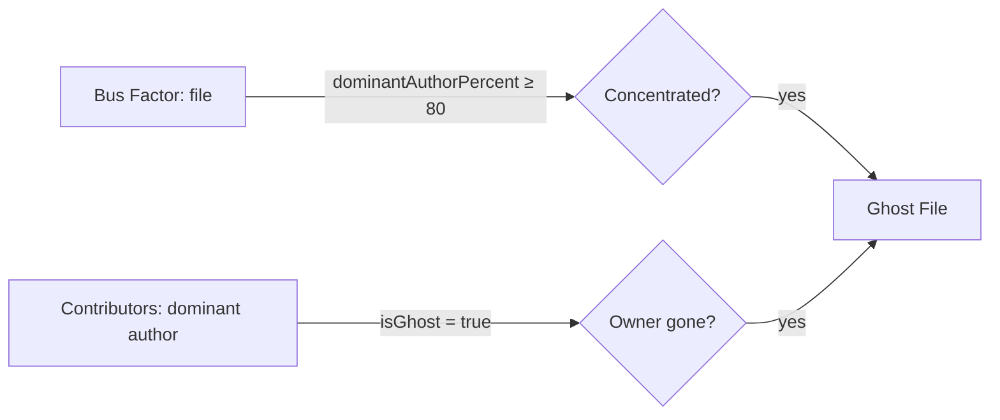

# Ghost Files

Ghost Files surfaces the **materialized knowledge-loss risk** in your repo: files where one author wrote essentially the whole thing AND that author has gone silent. Unlike Bus Factor (which models *theoretical* collapse risk regardless of activity), Ghost Files only flags risk that has *already* happened — you just haven't paid the bill yet.

The story it tells: *"knowledge has left even though work continues."*

::: tip Screenshot
TODO: drop screenshot of the polished Ghost Files tab here.
:::

## Quick read

- **Metrics strip (5 slots):** Ghost Files · Ghost Owners · True Ghosts (≥365d) · Fading (180–364d) · Ghost LOC.
- **Hero (sunburst):** Inner ring = ghost author identity. Outer ring = files owned by that author, sized by LOC, color-coded by inactivity tier.
- **Bottom-panel KPI:** Big number is **distinct ghost owners** (the people whose knowledge is at risk). Top-3 finding lists the highest-impact ghost owners. "Where they live" extras shows directory rollup.
- **Inspector:** Click any file in the sunburst to see per-file detail (author, last commit date, days inactive, LOC).

## How ghost files are detected

Ghost files are at the intersection of two predicates:

Both must be true. If either fails, the file is not a ghost.

**Concentration** uses an 80% ownership floor: at 80%+ of commits to a file, the dominant author *wrote* the file. At lower percentages, you still have enough distributed knowledge that someone else can plausibly carry the file forward.

**Owner silence** uses the contributors-analyzer `isGhost` flag, defined as `lastCommit < ghostCutoff` where `ghostCutoff = max(180 days, repoAgeDays * 0.5)`. The window scales with the analysis range — a 6-month window catches more "ghosts" than a 5-year window because the relative cutoff is tighter.

## The metrics strip

| Slot | Source | Severity bands |
|---|---|---|
| **Ghost Files** | total count | 0 healthy · 1–9 warning · 10+ critical |
| **Ghost Owners** | distinct dominant authors | 0 healthy · 1–2 warning · 3+ critical |
| **True Ghosts (≥365d)** | files with author silent over a year | 0 healthy · 1+ critical |
| **Fading (180–364d)** | files with author silent 6mo–1yr | 0 healthy · 1–9 warning · 10+ critical |
| **Ghost LOC** | total LOC across ghost files | <2% / 2–9% / 10%+ of repo total |

## Reading the surfaces

1. **Metrics strip** for the high-level health snapshot.
2. **Sunburst hero** for the directory-and-author view — slice by author cluster to see whose code is orphaned where.
3. **Narrative-KPI panel** for the actionable summary — top-3 ghost owners by impact and where their files cluster.
4. **Inspector** for per-file detail — click any file in the sunburst.

## What action it suggests

- **High ghost-owner count** → triage by author cluster (sunburst slice). Each ghost owner is a knowledge-transfer initiative.
- **High true-ghost count** → urgent code archaeology; the original authors have been silent over a year.
- **High ghost LOC %** → consider a formal knowledge-transfer push; the dormant code is a meaningful share of the codebase.

## The triangle: Ghost Files vs Bus Factor vs Knowledge Silos

| Analyzer | Concentration check | Activity check | Tells you |
|---|---|---|---|
| Knowledge Silos | yes (any concentration) | no | "concentration shape" |
| Bus Factor | yes (per file) | no | "potential collapse risk" |
| Ghost Files | yes (≥80%) | yes (`isGhost`) | "materialized knowledge gap" |

Ghost Files is the materialization of risk that the other two model abstractly.

## Ghost Files vs Stale Files

These analyzers operate on **disjoint file sets** — they cannot overlap.

- **Stale Files** flags files with **zero commits** in the analysis window (file is abandoned in code).
- **Ghost Files** flags files whose **dominant owner is silent**, regardless of whether *others* are still touching the file (file is abandoned in *knowledge*).

The most pernicious ghost files are exactly the ones that *aren't* stale — they look healthy on the surface (commits keep flowing from peripheral contributors), but the substance has rotted because the deep knowledge left.

## Limitations

- **Heuristic activity cutoff.** People on long leave look identical to people who left.
- **80% ownership may miss meaningfully-distributed files** where two or three authors share equal knowledge of a now-orphaned area.
- **Sliding window scales the cutoff.** A 6-month `--since` flag catches more "ghosts" than a 5-year analysis.
- **Renames are not followed.** A file moved post-departure shows as a fresh file with no ghost owner.
- **Bot accounts can show as ghosts** when CI/release bots roll over to new identities.

## Related analyzers

- **[Bus Factor](/analyzers/bus-factor)** — theoretical concentration risk
- **[Knowledge Silos](/analyzers/knowledge-silos)** — concentration shape
- **[Contributors](/analyzers/contributors)** — who's active, who's gone
- **[Cursed Files](/analyzers/cursed-files)** — multi-dimensional risk scoring (consumes ghost-files signal)
