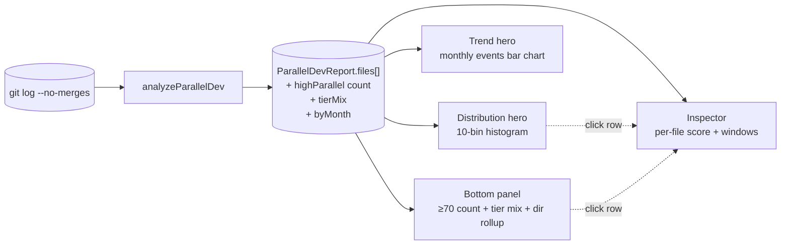

# Parallel Dev

**Parallel Dev** measures temporal concurrency: files where two or more distinct authors commit during the same ISO calendar week. It's a *social* signal rather than a structural one — the analyzer never reads a file's contents, only who touched it and when. The pattern matters because empirical research has linked concurrent multi-author work to elevated defect rates: when several engineers edit the same file in the same week, their changes tend to interact in ways neither of them anticipated.

The Parallel Dev analyzer answers two questions:

- **"Which files have the most coordination overhead?"** — the per-file leaderboard.
- **"Is parallel-development pressure trending up or down across the repo?"** — the temporal view.

The reference here is Meneely & Williams' *"Secure open source collaboration: an empirical study of Linus' law,"* which found Linux kernel modules with the most parallel multi-author activity also showed the most security-related defects. The mechanism isn't surprising — context handoffs are expensive, and concurrent edits multiply the chance that nobody fully owns the resulting interleaving.

::: tip Screenshot
**TODO:** Capture the Parallel Dev analyzer view (sidebar selection, `Distribution` hero default tab, `Trend` alt tab, bottom-panel narrative-KPI with "where they live" extras when populated, right-side Inspector populated). Save to `apps/docs/public/images/analyzers/parallel-dev-overview.png`, then replace this callout with ``.
:::

## Quick read

If you only have ten seconds:

- **Top of the screen** (`Distribution` hero, default tab) — 10-bin histogram of parallel scores across the repo. Bar height is file count, color is tier, and the ≥70 zone is shaded so the headline threshold is visible at a glance.
- **Top of the screen** (`Trend` alt tab) — monthly bar chart of parallel-event counts. Bar height is the number of `(file, week)` parallel events that month; bar color tints from healthy → critical based on the average author count per event.
- **Bottom panel** (narrative KPI) — count of files with `parallelScore ≥ 70`, top-3 most-contested files with their parallel-week counts and peak author counts, a 3-tier mix subline, and a "where they live" directory rollup.
- **Right-side Inspector** — click any file row to see its full per-file profile (parallel score, parallel weeks, peak authors, top windows).

## How parallel dev is measured

The full pipeline, from raw git output to the dashboard surfaces:



The analyzer iterates every commit, projects each commit's date onto its ISO calendar week (Monday-anchored, UTC), and builds a `(file, week) → { authors, commitCount }` matrix. Any `(file, week)` cell with two or more distinct authors counts as a **parallel event** for that file in that week.

A few specifics worth knowing:

- **Window:** the full reachable history of the analyzed branch, bounded by `--since=<date>` if provided.
- **Merge commits are excluded** (`--no-merges`). A merge that touches 50 files doesn't fabricate parallel work between the merger and the original authors.
- **Co-authored commits count as a single author** at this layer — the matrix keys by `commit.authorEmail` only. Multi-author co-commits surface separately in the [Co-Authors](/analyzers/co-authors) analyzer.
- **Renames are *not* followed.** A file's parallel history is attributed to its current path; pre-rename activity is scored against the old path. See [Rename Tracking](/analyzers/renames).
- **Files with fewer than 3 active weeks are skipped.** Even if a file had a parallel week, three weeks of total activity is the floor for the score's denominator to be meaningful — below that, a single parallel week dominates the ratio in misleading ways.
- **Files with `parallelScore < 20` are skipped.** The minimum-signal floor keeps the leaderboard from being polluted by files with one parallel week out of fifty.

## The score formula

For each file that survives the floors, the analyzer computes:

```
parallelEntries  = weeks where bucket.authors.size >= 2
baseScore        = (parallelEntries / totalActiveWeeks) × 100
avgAuthors       = mean(authorsPerParallelWeek)
severityMult     = clamp(avgAuthors / 2, 1.0, 2.0)
parallelScore    = round(min(baseScore × severityMult, 100))
```

The **base score** is the share of a file's active weeks that were multi-author — a pure ratio in `[0, 100]`. A file edited every week for a year with a handful of dual-author weeks scores low; a file edited rarely but always by 2+ people scores high.

The **severity multiplier** weights more-crowded weeks more heavily. A file with 5 parallel weeks averaging 4 authors per week scores higher than another file with the same 5 parallel weeks averaging 2 authors per week — even though both have the same `parallelEntries / totalActiveWeeks` ratio. The multiplier is bounded `[1.0, 2.0]` so it can boost but never collapse the base score.

The final `parallelScore` is clamped to a `[0, 100]` ceiling.

Three worked examples make the formula concrete:

| File | active wks | parallel wks | avg authors | base | mult | `parallelScore` |
|---|---|---|---|---|---|---|
| `cool.ts` | 10 | 1 | 2 | 10 | 1.0 | **10** *(filtered, < 20)* |
| `warm.ts` | 10 | 5 | 2 | 50 | 1.0 | **50** |
| `chaos.ts` | 4 | 4 | 4 | 100 | 2.0 | **100** *(clamped)* |

### The four tiers

Each scored file's `parallelScore` buckets into four tiers, used to color the histogram:

| Tier | Score | Meaning |
|---|---|---|
| **low** | < 25 | Occasional concurrent edits. Normal collaboration. |
| **medium** | 25–49 | Modest parallel signal. Worth knowing. |
| **high** | 50–74 | A meaningful share of the file's edits happen alongside other authors' edits. |
| **critical** | 75–100 | Most of the file's active weeks were multi-author. Coordination cost is high. |

The narrative-KPI's headline number uses a slightly different cut: **files with `parallelScore ≥ 70`** ("high parallel"). That threshold spans the upper half of *high* plus all of *critical*, giving the panel a more useful "files thrashing under coordination" headcount than the strict tier boundary. The bottom panel's 3-tier subline collapses the storage to `low` (< 25) / `moderate` (25–49) / `high` (50+) for legibility — `critical` doesn't add forensic information over `high` once the threshold is crossed.

## Reading the surfaces

### The hero — `Distribution` (default tab)

A 10-bin histogram of `parallelScore` across all scored files, bucketed in widths of 10 (0–9, 10–19, …, 90–100). Bars are colored by the tier of the bucket's midpoint, and the right side of the chart is shaded to mark the **high-parallel threshold** (`≥70`) — the same threshold the bottom panel's headline number uses.

The hero answers **"is concurrent-edit risk concentrated or evenly distributed?"** Three shapes worth recognizing:

- **Left-leaning long tail** — most files have only occasional parallel work; a few sneak into the high band. Healthy collaboration pattern. The KPI count is small and the few high-parallel files are isolated coordination hotspots.
- **Bimodal** — a hump in the low–medium range and a second smaller hump in the high band. The codebase has a distinct set of files that consistently attract multi-author attention, separate from the bulk of the repo. Often these are integration points, shared utilities, or contested architectural boundaries.
- **Right-shifted distribution** — files cluster in the medium-to-high range. Unusual and usually means either (a) the team is small and everyone touches everything, in which case the score is technically correct but its forensic value is muted, or (b) the analysis window is very short — short windows compress active-week counts, making any parallel week look like a larger share of the file's history.

### The hero — `Trend` (alt tab)

A monthly bar chart of repo-aggregate parallel events. Each bar represents one ISO calendar month; bar height is the number of `(file, week)` cells in that month where two or more authors committed; bar color is tinted by the average author count across those events.

The hero answers **"is parallel-development pressure trending up or down? Are concurrent-edit weeks getting more crowded?"** The color tint matters as much as the height:

- **Green bars (avg authors ≤ 2)** — most parallel events are simple two-author overlaps. Likely natural collaboration; not a coordination crisis even when the bar is tall.
- **Yellow bars (avg authors ≈ 3)** — meaningful coordination overhead. Worth knowing what's driving it.
- **Red bars (avg authors ≥ 5)** — chaos weeks. Many people, same files, same week. Almost always traces to a specific incident, sprint, or refactor that pulled the team onto shared code.

A *tall green bar* is qualitatively different from a *short red bar*: the first is high volume of low-stakes overlaps, the second is low volume of high-stakes overlaps. Both deserve attention but the suggested actions differ.

### The bottom panel — narrative KPI

A single panel, not a table. The left-side big number is **the count of files with `parallelScore ≥ 70`**, badge-colored by severity (0 = Healthy, 1–4 = Moderate, 5+ = High Concurrency). The thresholds mirror Rewrite Ratio's absolute-count thresholds — concurrency-heavy files are uncommon at any repo size, so absolute thresholds read more cleanly than proportional ones.

The right side carries three pieces of context:

1. **Top parallel files** — the three highest-scoring files (sliced from the threshold-filtered subset, never from the whole-repo top-10), with their parallel-week counts and peak author counts. Three is enough to show "the worst is not alone" without making the panel feel like a table; the right-side Inspector remains the place to drill into any single file's full profile.
2. **3-tier subline** — `X high · Y moderate · Z low`. The collapse from the 4-bucket storage (`low / medium / high / critical`) is deliberate: in this analyzer, "critical" doesn't carry distinct forensic information over "high" — once a file crosses the 50+ band, the cost of coordination is already manifest. Three labels read more cleanly than four for the headline subline; the underlying storage stays four-bucket so cross-analyzer comparisons remain consistent.
3. **"Where they live" rollup** — directory-level breakdown of the high-parallel files. Each row shows the immediate parent directory, the number of high-parallel (`≥70`) files inside it, the share of the repo's total high-parallel count, and a small bar visualizing that count relative to the largest directory. Top 5 directories, sorted by count desc with alphabetical tiebreak. When more than 5 distinct directories hold high-parallel files, the rollup ends with a `+ N more directories` line so the long tail is acknowledged rather than silently truncated. The rollup is hidden when no files cross the threshold.

The sticky **See also** footer links to two related analyzers:

- **Co-Authors** — co-authored commits (the `Co-authored-by:` trailer pattern) — the *intentional* collaboration counterpart to parallel dev's *implicit* concurrent-work signal.
- **Coupling** — file pairs that change together. A file with high parallel scores AND high coupling means multiple authors are touching its dependents in the same week, which compounds the coordination cost.

### The right-side Inspector

Click any file row in another analyzer's tab and the Inspector populates with that file's full per-file profile. For Parallel Dev, the relevant fields are `parallelScore`, `parallelWeeks` / `totalActiveWeeks`, `peakAuthors` (the maximum simultaneous author count in any single week), and the `peakWindow` itself (which authors, which week). The peak-window detail is what turns the score into a story — knowing *who* was in the room when the parallel work happened, and *which week*, is usually what unlocks the next conversation.

## What action it suggests

Parallel Dev is a coordination-cost signal, not an indictment of collaboration. A few patterns worth acting on:

- **High-parallel file with also-high churn or hotspot score** — the file is contested *and* unstable. Almost always a refactor candidate. Either reduce its surface (split into modules with clearer ownership) or formalize its review path (require a specific reviewer). The current pattern has the team paying coordination cost without realizing it.
- **A red bar in the Trend hero** — investigate what drove that month. Check the commit log for the spike's week range; usually you'll find a specific incident, sprint kickoff, or framework migration. Not always a problem, but always worth knowing.
- **One directory dominating "where they live"** — the module is a coordination hotspot. Likely candidates: shared utilities everyone has to touch, configuration files everyone has to bump, or integration points with weak ownership. Tightening contracts or splitting the module usually helps.
- **High parallel score on a single-author file** (cross-reference with [Bus Factor](/analyzers/bus-factor)) — apparent contradiction. Usually means the dominant author commits frequently *and* is supplemented periodically by others. Worth checking the peak window in the Inspector to understand who the supplementary authors are.

## Limitations

- **Heuristic, not behavioral.** The analyzer measures *who committed when*, not *what they committed to do*. Two authors who happened to touch the same file in the same week for unrelated reasons score the same as two authors actively coordinating on a feature. Read the Inspector's `peakWindow` and `topWindows` alongside the score; the analyzer is a starting point for triage, not a verdict.
- **ISO-week binning is arbitrary.** A Friday commit and the following Monday commit are in different weeks even though they're three days apart; a Monday commit and the following Friday commit are in the same week even though they're four days apart. The Monday-anchored ISO week is the standard convention but it does occasionally split or merge real coordination episodes.
- **Active-weeks floor delays signal for new files.** A file needs at least 3 active weeks to be scored at all, which means files added recently won't appear even if they're already showing high concurrent-edit pressure. Run with a longer `--since` window if recent-file coordination is the question.
- **Window-length sensitivity.** Short analysis windows compress active-week counts, making a single parallel week look like a larger share of the file's history. Use `--since=<date>` deliberately, and prefer at least a few months of history when concurrency signal is the question.
- **Co-author trailers are invisible at this layer.** A `Co-authored-by: alice@example.com` trailer on bob's commit doesn't make alice an author of that commit for parallel-dev purposes — only `commit.authorEmail` is keyed. The [Co-Authors](/analyzers/co-authors) analyzer surfaces co-author relationships explicitly when that's the question.
- **Renames break continuity.** A file's parallel history is attributed to its current path; pre-rename activity is scored against the old path. See [Rename Tracking](/analyzers/renames).
- **Pre-1.0.** The active-weeks floor, the minimum parallel score, the severity multiplier shape, and the high-parallel threshold may change. See [CHANGELOG](https://github.com/nebulord-dev/gitrelic/blob/main/CHANGELOG.md) for shifts.

## Related analyzers

- **[Co-Authors](/analyzers/co-authors)** — explicit co-authorship via the `Co-authored-by:` trailer. Parallel Dev is the *implicit* pattern (people working alongside each other on the same file in the same week without coordinating); Co-Authors is the *explicit* pattern (people deliberately credited together on a single commit). The two are complementary: a high parallel-dev signal with low co-author overlap means people are *not* coordinating; high signal in both means coordination is happening but the load is heavy.
- **[Coupling](/analyzers/coupling)** — file pairs that change together in commits. A file with high parallel scores AND a high coupling partner has people working on it concurrently while *also* its dependents are co-changing — the coordination cost compounds.
- **[Bus Factor](/analyzers/bus-factor)** — ownership concentration per file. A file with high parallel scores and a low bus factor (one dominant author) typically means the dominant author is being supplemented by drive-by contributors; high parallel + high bus factor (many authors) means the file has no clear owner at all.
- **[Web Dashboard](/dashboard/)** — the rendering layer that hosts the Distribution / Trend heroes and the narrative-KPI bottom panel.
