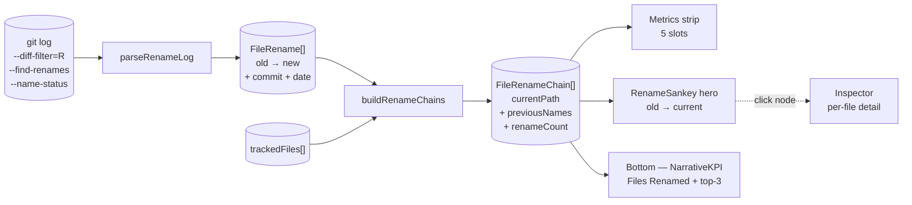

# Rename Tracking

The **Rename Tracking** analyzer walks `git log --diff-filter=R --find-renames --name-status` to reconstruct, for each currently-tracked file, the chain of historical names it has carried. It tells you *how much restructuring this codebase has absorbed, and where the chains live*.

The analyzer answers two related questions:

- **"How much of this codebase has been renamed?"** — the headline KPI.
- **"Which files have moved through multiple names, and where do those chains end up?"** — the sankey hero + Inspector drill-in.

This is **structural-history reconstruction**, not a risk metric. Many of the other analyzers in GitRelic carry a *"renames are not followed"* caveat — Churn, Age Map, Bus Factor, Blast Radius, Rewrite Ratio, Parallel Dev, Shame, Co-Authors all attribute history to a file's *current* path and lose continuity across renames. Rename Tracking is the surface where that lost continuity is made visible: scan the chains here when you suspect another analyzer is undercounting a file's true history.

::: tip Screenshot
TODO: drop screenshot of the polished Rename Tracking tab here.
:::

## Quick read

If you only have ten seconds:

- **Metrics strip** — five slots: `Files Renamed` · `Total Renames` · `Longest Chain` · `Avg Renames/File` · `Most Renamed`. Headline shape of restructuring activity.
- **Hero (sankey)** — old name → current name, one row per chain, every chain rendered (not just top-N). **Click any node** to inspect that file in the right-side panel.
- **Bottom panel (narrative KPI)** — `Files Renamed` headline; tier badge classifies the codebase's rename shape; top-3 most-renamed files in the finding; subline carries totals + longest chain + tracked-files percent.
- **Inspector** — per-file detail (current path, previous names, rename count) on click.

## How rename chains are reconstructed

The full pipeline, from raw git output to the dashboard surfaces:

The analyzer:

1. Asks git for every rename-status commit using `--diff-filter=R --find-renames` and a `COMMIT|<hash>|<date>` separator line per commit so renames stay anchored to their commit + date.
2. **Parses each `R<score>\told\tnew` line** into a `FileRename { oldPath, newPath, commitHash, date }` event.
3. **Builds a reverse map** from `newPath` → `[{ oldPath, commitHash, date }, …]` after sorting renames chronologically. When git emits multiple renames *to* the same path, the most recent wins (the others are typically intermediate steps in the same chain).
4. **Walks each tracked file backwards** through the reverse map, prepending each `oldPath` it finds. A `visited` set guards against rare A→B→A-style cycles.
5. **Emits a `FileRenameChain`** for any tracked file that picked up at least one previous name during the walk.

A few specifics worth knowing:

- **`--find-renames` similarity threshold.** Git defaults to 50% content similarity between the deleted and added file. Heavy rewrites alongside a rename can fall under the threshold and look like a delete + create instead of a rename.
- **Pre-rename content history is not followed.** The chain stops at the oldest detected `oldPath` — the analyzer does not recursively chase that path's *own* history. Lifecycles longer than git's rename detection horizon get truncated.
- **Cycles are guarded but rare cycle-like patterns flatten.** A file renamed to a sibling, then renamed back, collapses to "no rename" because the visited-set short-circuits the walk.
- **Bot-driven mass-renames inflate `totalRenames`.** Formatter/codemod commits that touch hundreds of paths produce hundreds of rename events. The number reflects what git emitted; interpret with that in mind.

## The metrics strip

Five KPI slots appear at the top of the Rename Tracking pane.

### Files Renamed

`filesWithRenames` — count of currently-tracked files that have at least one historical name. Same value the bottom-panel KPI headlines, just rendered as a glanceable counter here. Healthy grey at 0; accent color at any positive count.

### Total Renames

`totalRenames` — count of rename *events* across the analyzed range. A single file with a multi-step chain contributes multiple events. A directory restructure that moved 30 files in one commit contributes 30 events.

### Longest Chain

`max(chain.renameCount)` across all tracked files. `0` (em-dash) when there are no chains; warning-color at 5+ steps; otherwise accent. Multi-step chains (≥ 2) are uncommon and worth eyeballing.

### Avg Renames/File

`round(totalRenames / filesWithRenames)`. Em-dash on a no-rename repo. On most repos this is 1; values > 1 indicate the dominant rename pattern is *re-renaming*, not *restructure*.

### Most Renamed

The basename of the chain with the highest `renameCount`. Em-dash when there are no chains. Trivia at first glance, but on repos with one dominant chain this is *the* outlier story.

## The bottom panel

A **narrative-KPI** panel — the same shape used for Knowledge Silos, Ghost Files, Co-Authors / AI, Blast Radius, and several others.

### Big number

`filesWithRenames` again — the *headline* metric. The metrics strip carries the same number as a glanceable counter; the panel re-uses it as the lead because no other slot answers "how much of this codebase has been renamed?" on the screen, and the panel needs a decisive headline.

### Tier badge

The badge classifies the codebase's *rename shape*, not its risk:

| State | Tier | Meaning |
|---|---|---|
| `filesWithRenames === 0` | `No Renames` (neutral grey) | The codebase has no detected rename history in this analysis window. |
| `filesWithRenames > 0`, `longestChain ≤ 1` | `Renames Tracked` (accent) | Surface renames only — every chain is a single old → new pair. Typical of a directory restructure. |
| `filesWithRenames > 0`, `longestChain ≥ 2` | `Tracked Chains` (accent) | At least one file has been renamed *and renamed again*. Multi-step structural history exists. |

The tiers are intentionally **informational**, not severity-coded. A repo with many renames isn't unhealthier than one with none — it's just had more restructuring. The dashboard's `severity-critical` colors are reserved for risk axes (bus factor, ghost files, etc.), and rename volume is a workflow-shape signal.

### Finding (top-3 most renamed)

The top-3 most-renamed files appear under a `Most renamed` label. Each row shows the file's basename, the parent directory in muted text, and the rename count. Sorted by `renameCount` descending, with basename-alphabetical tiebreaker.

When the codebase has only length-1 chains, the top-3 list still surfaces — three arbitrary alphabetical chains is fine context, even though the count column shows `1` for each. When the codebase has *one* multi-step chain (typical), that chain leads the list with its full count and the next two slots fill alphabetically with length-1 chains.

The list is read-only — clicking a row does *not* drive the Inspector. Use the sankey hero for click-to-inspect.

### Subline

A single line carries the aggregate triple:

> `<totalRenames> renames · longest chain: <N> step(s) · <pct>% of tracked files have rename history`

`pct` uses `report.loc.totalFiles` as the denominator. Empty-repo guard returns `0%` so the subline never renders `NaN%`.

### See also

Sticky "see also" footer links to **Hotspots** and **Churn** — both consume rename-broken file paths, and they're the analyzers users most often hop to when rename continuity matters.

## Reading the surfaces

The intended scan order:

1. **Metrics strip** for the headline shape — *"is there rename activity at all, and what's its size?"*
2. **Sankey hero** for the structural map — *"old name → current name, every chain at a glance."* Click any node to open Inspector.
3. **Bottom panel KPI** for the actionable summary — *"top-3 most-renamed files, total renames, longest chain, % of tracked files."*
4. **Inspector** for per-file detail when a sankey click selects a node.

Sankey-specific reading tips:

- **Color encodes terminus.** Current paths render in the accent color; previous (intermediate) names render in muted grey. The endpoint of every flow is the file's current name.
- **Stroke encodes selection.** A clicked node has a thicker accent stroke around its rect. The selection persists across hover so you can read the Inspector without losing the highlight.
- **Width is uniform per step.** Every link is `value: 1`. The sankey's flow widths reflect node fan-in / fan-out, not weighted edge counts. Two chains landing on the same destination produce a wider terminus rect, which is the signal worth looking at.
- **Labels prefer minimal disambiguation.** When two paths share a basename, the displayed label walks one parent directory at a time until they're distinguishable. Files with unique basenames render as basename-only.

## What action it suggests

- **High `filesWithRenames` %** → expect cross-analyzer continuity gaps in the affected paths. Pre-rename history is attributed to old paths in Churn / Age Map / Bus Factor / Blast Radius / Rewrite Ratio / Parallel Dev / Shame / Co-Authors. If those analyzers' top-N files include a renamed file, the score is undercounted.
- **High `Longest Chain`** → archaeology candidate. Multi-step chains often correspond to libraries that moved between packages or modules that got refactored repeatedly. Path history is harder to read than usual; the sankey is the easiest way to scan it.
- **Top-renamed file is unfamiliar** → spot-check whether the rename was a refactor, a directory move, or a content rewrite that git heuristically matched. Open the file in `git log --follow` to see whether the chain represents real continuity or a similarity coincidence.

## Limitations

- **`--find-renames` similarity threshold.** Git's default 50% content similarity hides renames that come paired with heavy rewrites. The dashboard cannot recover what git didn't emit.
- **Pre-rename content history is not followed.** Chains stop at the oldest detected `oldPath`; the analyzer does not chase *that* path's history recursively.
- **Cycles are guarded.** A→B→A-style patterns collapse to "no rename" because the visited-set walk short-circuits.
- **Bot-driven mass-renames inflate counts.** Formatter / codemod commits that touch many paths produce many rename events. Filter by author or commit message in `git log` directly when you suspect this.
- **Analysis window scopes the input.** A `--since` flag bounds the rename log; renames older than the window are invisible to the analyzer.

## Related analyzers

- **[Hotspots](/analyzers/hotspots)** — rename-broken paths often appear in the hotspot ranking with undercounted history.
- **[Churn](/analyzers/churn)** — `commitCount` reflects only the current path. Use this analyzer to reconstruct the full lifecycle.
- **[Coupling](/analyzers/coupling)** — co-change pairs are keyed by file path; renames can split a pair into two underweighted halves.
- **[Cursed Files](/analyzers/cursed-files)** — multi-dimensional risk scoring inherits the rename-blindness of its constituent analyzers.

### The "renames are not followed" callout

Several analyzer pages flag this caveat explicitly. **Rename Tracking is the surface that answers them.** Cross-reference any of the following when their top-N includes a file you suspect was renamed:

- [Age Map](/analyzers/age-map) — `ageInDays` measures only commits under the current path.
- [Blast Radius](/analyzers/blast-radius) — co-change counts attribute pre-rename commits to old paths.
- [Bus Factor](/analyzers/bus-factor) — ownership concentration is computed on the current path's commits only.
- [Churn](/analyzers/churn) — `commitCount` is current-path-only.
- [Co-Authors / AI](/analyzers/co-authors) — pair-graph shared-file counts are current-path-keyed.
- [Parallel Dev](/analyzers/parallel-dev) — concurrency events are scored against the current path.
- [Rewrite Ratio](/analyzers/rewrite-ratio) — insertion / deletion totals are current-path-keyed.
- [Shame](/analyzers/shame) — keyword-tier scores attribute pre-rename commits to old paths.
