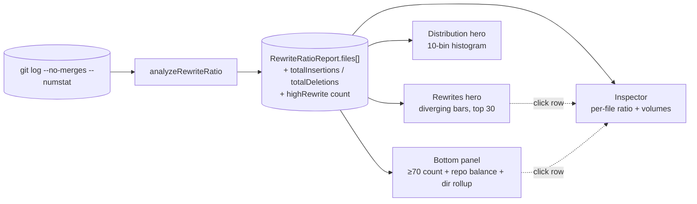

# Rewrite Ratio

**Rewrite Ratio** measures how balanced a file's edits are between insertions and deletions across its history. A file with high rewrite ratio is one whose lines keep getting *replaced* — every push reverts or rewrites a previous push of similar size. That pattern is distinct from steady growth (mostly insertions) or steady shrinkage (mostly deletions); it's the signature of code that hasn't found its shape yet.

The Rewrite Ratio analyzer answers one question:

- **"Which files keep getting rewritten — code that doesn't stick?"**

Why this matters: rewrite churn is a different cost than commit churn. A file can have a low commit count and still have a brutally high rewrite ratio — every commit there flipped half its lines. Pure-insertion files grow; pure-deletion files shrink; rewrite-heavy files thrash, and the line-volume-balanced ratio is the only signal that picks them out cleanly.

::: tip Screenshot
**TODO:** Capture the Rewrite Ratio analyzer view (sidebar selection, `Rewrites` hero default tab, `Distribution` alt tab, bottom-panel narrative-KPI with "where they live" extras, right-side Inspector populated). Save to `apps/docs/public/images/analyzers/rewrite-ratio-overview.png`, then replace this callout with ``.
:::

## Quick read

If you only have ten seconds:

- **Top of the screen** (`Rewrites` hero, default tab) — top 30 files by rewrite score, drawn as horizontal diverging bars (deletions left of center, insertions right). Bar length is proportional to absolute volume so visual emphasis tracks real magnitude, not just balance.
- **Top of the screen** (`Distribution` alt tab) — 10-bin histogram of rewrite scores across the whole repo. Bar height is file count, color is tier, and the ≥70 zone is shaded so the headline threshold is visible at a glance.
- **Bottom panel** (narrative KPI) — count of files with `rewriteScore ≥ 70`, top-3 rewriters with their absolute insertion / deletion volumes, repo-wide insertion / deletion balance, and a "where they live" directory rollup.
- **Right-side Inspector** — click any file row in another analyzer's tab to see its rewrite ratio alongside hotspot, churn, ownership, age, and the rest.

## How rewrite ratio is measured

The full pipeline, from raw git output to the dashboard surfaces:



For each commit, the analyzer reads `--numstat` line counts for every file the commit touched. After processing every commit, each tracked file has two accumulated totals:

- **`totalInsertions`** — lines added across the file's full history.
- **`totalDeletions`** — lines removed across the file's full history.

The 0–100 **`rewriteScore`** combines those two totals through a confidence-weighted balance formula (below).

A few specifics worth knowing:

- **Window:** the full reachable history of the analyzed branch, bounded by `--since=<date>` if provided.
- **Merge commits are excluded** (`--no-merges`). A merge commit's line counts double-count the work that's already attributed to the branch's individual commits.
- **Only currently-tracked files are scored.** Files deleted before scan time are filtered out via `git ls-files`, even if their old commits still appear in the log.
- **Renames are *not* followed.** A renamed file's pre-rename insertion / deletion history is attributed to the old path. The [Rename Tracking](/analyzers/renames) analyzer surfaces these chains explicitly when you need to reconstruct continuity.
- **Files with zero net change are skipped.** A file with `totalInsertions = 0` and `totalDeletions = 0` (e.g. a pure binary asset that git tracks but doesn't diff) does not appear in `files[]`.

## The score formula

For each file, the analyzer computes:

```
maxVal       = max(totalInsertions, totalDeletions)
minVal       = min(totalInsertions, totalDeletions)
ratio        = minVal / maxVal               // raw 0..1 balance
rawScore     = ratio × 100                   // 0..100
confidence   = min(1, minVal / 30)
rewriteScore = round(rawScore × confidence)
```

The **ratio** captures balance: 0 means a file only ever grew or only ever shrank; 1 means insertions and deletions are perfectly matched. The smaller side of the diff is the rewrite signal — that's the part that actually replaces existing code rather than extending or removing it — so it's also the basis for confidence.

The **confidence multiplier** dampens scores for files without enough rewrite volume to trust the ratio. The floor is 30 lines: a file needs at least 30 of its smaller-side lines to reach the full ratio. Below that, the score is scaled down proportionally.

Three worked examples make the formula concrete:

| File | `+ins` | `−del` | raw ratio | confidence | `rewriteScore` |
|---|---|---|---|---|---|
| `config.yml` | 1 | 1 | 1.00 | 1/30 = 0.033 | **3** |
| `Component.tsx` | 30 | 30 | 1.00 | 1.00 | **100** |
| `data.json` | 800 | 50 | 0.06 | 1.00 (capped) | **6** |

Without the multiplier, the first row would tie at 100 with the second — single-edit configs would flood the leaderboard. The multiplier preserves the score's *meaning* at high volume while filtering low-volume noise out of the top of the chart.

### The four tiers

Each file's `rewriteScore` buckets into four tiers, used to color the histogram:

| Tier | Score | Meaning |
|---|---|---|
| **low** | < 25 | Edits skew strongly toward growth or shrinkage. Code mostly sticks. |
| **medium** | 25–49 | Modest rewrite signal. Normal evolution. |
| **high** | 50–75 | Insertions and deletions roughly comparable. Worth a look. |
| **critical** | 76–100 | Highly balanced and high-volume. Code that doesn't stick. |

The narrative-KPI's headline number uses a slightly different cut: **files with `rewriteScore ≥ 70`** ("high rewrite"). That threshold is broader than the *critical* tier — it captures the upper half of *high* plus all of *critical*, giving the panel a more useful headcount of "files thrashing in place" than the strict tier boundaries would.

## Reading the surfaces

### The hero — `Rewrites` (default tab)

A horizontal diverging bar chart of the top 30 files by `rewriteScore`. Each row shows:

- **Left of center** — total deletions (red).
- **Right of center** — total insertions (green).
- **Bar length** — proportional to absolute volume, normalized against the row with the largest single side. So a row with `+800 / −800` extends nearly to the chart edges; a row with `+30 / −30` is a small bar near the center even though both score 100.
- **Score** — printed on the right, badge-colored by tier.

The hero answers **"which files keep getting rewritten, and how much code is involved?"** The score alone wouldn't be enough — every `+30 / −30` file ties at 100 with `+800 / −800`, but the latter has 26× more code under rewrite stress. The diverging bar puts the volume context directly into the chart, so the eye can sort the leaderboard by *real* rewrite cost rather than just the normalized score.

A few shapes worth recognizing:

- **A handful of long bars at the top, then a sharp drop-off** — a small number of architectural files are doing nearly all the rewriting. Triage candidates.
- **All bars roughly equal length, sitting at high scores** — every top-30 file has comparable rewrite mass. The codebase has a wide rewrite surface; pick by other signals (churn, ownership) to triage further.
- **All bars short (low absolute volume) at high scores** — the confidence floor is doing its job, but most rewrite signal in the repo lives in low-volume files. Either the repo is small, or the rewrite story is dominated by config / fixture files.

### The hero — `Distribution` (alt tab)

A 10-bin histogram of `rewriteScore` across all analyzed files, bucketed in widths of 10 (0–9, 10–19, …, 90–100). Bars are colored by the tier of the bucket's midpoint, and the right side of the chart is shaded to mark the **high-rewrite threshold** (`≥70`) — the same threshold the bottom panel's headline number uses.

The hero answers **"is rewrite stress concentrated or evenly distributed?"** Three shapes, three different stories:

- **Left-leaning long tail** — most files are write-once-and-leave-it; a few bars sneak into the high band. Healthy. The KPI count is small; the few high-rewrite files are isolated thrashers worth knowing about.
- **Bimodal** — a hump in the low–medium range and a second smaller hump in the high band. The codebase has a clear set of files that thrash on a different timescale than the bulk of the repo.
- **Right-shifted distribution** — files cluster in the medium-to-high range. Unusual, and usually means the analysis window is too short (small windows can inflate every file's apparent balance, since insertions and deletions haven't had time to diverge).

### The bottom panel — narrative KPI

A single panel, not a table. The left-side big number is **the count of files with `rewriteScore ≥ 70`**, badge-colored by severity (0 = Healthy, 1–4 = Moderate, 5+ = High Rewrite). The thresholds mirror Blast Radius and Shame's absolute-count thresholds so the headline is comparable across analyzers — high-rewrite files are uncommon at any repo size, so absolute thresholds read more cleanly than proportional ones.

The right side carries three pieces of context:

1. **Top rewrite files** — the three highest-scoring files (sliced from the threshold-filtered subset, never from the unfiltered top-10), with their absolute insertion / deletion volumes. Three is enough to show "the worst is not alone" without making the panel feel like a table; the right-side Inspector remains the place to drill into any single file's full profile.
2. **Repo-balance subline** — the unique angle of this analyzer: total insertions vs. total deletions across the entire window, with a net delta and a `% of files balanced` figure (files with `ratio > 0.5`). Answers "is this a growth codebase or a maintenance codebase?" — a question none of the other analyzers can answer, because they all score per-file and never summarize repo-wide line flow.
3. **"Where they live" rollup** — directory-level breakdown of the high-rewrite files. Each row shows the immediate parent directory, the number of high-rewrite (`≥70`) files inside it, the share of the repo's total high-rewrite count, and a small bar visualizing that count relative to the largest directory. Top 5 directories, sorted by count desc with alphabetical tiebreak. When more than 5 distinct directories hold high-rewrite files, the rollup ends with a `+ N more directories` line so the long tail is acknowledged rather than silently truncated.

Why a KPI and not a table: the Rewrites hero already shows the worst per-file scores with their volumes baked in; the Distribution hero shows the over-time picture; the Inspector shows full per-file detail on click. The aggregate count, the repo-wide balance, and the directory rollup are the three questions none of the other surfaces answer. A sortable file table on the bottom would have been a worse version of those three answers stacked — it would have rotated the diverging-bar hero into a less-readable layout while losing the repo-balance line entirely.

The sticky **See also** footer links to two related analyzers:

- **Churn** — same shape, different unit. Churn counts commits; rewrite ratio counts lines. A high-churn file with low rewrite ratio is a steady grower; a low-churn file with high rewrite ratio is a small file that flips itself end to end on every commit.
- **Hotspots** — churn × LOC composite. A high-rewrite file is worse on a hot, complex hotspot than on a stable utility.

### The right-side Inspector

Click any file row in another analyzer's tab and the Inspector populates with that file's full per-file profile, including `Rewrite ratio` (the raw 0..1 balance value, not the multiplied score), the file's total insertions, and total deletions. The Inspector reads `ratio` directly so it's unaffected by changes to the confidence multiplier — it shows the underlying mathematical truth of the file's balance.

## What action it suggests

Rewrite Ratio is a triage signal, not an indictment. A few patterns to act on:

- **Critical-tier files at the top of the diverging bar** — these are the strongest refactor candidates. A file whose lines have been replaced 800-for-800 over the analysis window has been resisting clean changes; a focused refactor pass usually pays for itself.
- **Right-shifted distribution overall** — the codebase is in active rewrite mode. Acceptable during a re-platforming sprint or a major version cut; worrying outside of those contexts.
- **Concentrated directory in the rollup** — when a single directory holds half or more of the repo's high-rewrite files, consider whether the module's contracts are too brittle or the abstractions are wrong. Splitting ownership or introducing clearer interfaces often helps.
- **High-rewrite file with single ownership** (cross-reference with [Bus Factor](/analyzers/bus-factor)) — the file is both thrashing *and* under-witnessed. Pair-program the next change there, or rotate review responsibility.

## Limitations

- **Heuristic balance, not semantic balance.** The analyzer measures *line-count* balance, not *meaning* balance. A file that grew 100 lines and then deleted 100 unrelated lines scores the same as a file whose 100 added lines were the same lines that later got deleted. Read the Rewrites hero alongside the Inspector's commit history; the analyzer is a starting point for triage, not a verdict.
- **Confidence floor delays signal for small files.** Files with fewer than 30 minimum-side lines get their score scaled down proportionally, which means a tightly-scoped utility that's been balanced 5-for-5 over its life will score around 17 even though the pattern is real. The Inspector still shows the raw ratio (1.0); the leaderboard just won't surface the file until it earns enough rewrite volume to trust the score.
- **Window-length sensitivity.** Short analysis windows compress the difference between growth and rewrite — every file looks more balanced when its history is truncated. Use `--since=<date>` deliberately, and prefer at least a few months of history when the rewrite signal is the question.
- **Pure refactors look like rewrites.** A clean rename refactor that swaps `oldName → newName` across a file produces equal insertions and deletions, scoring high even though no logic changed. Pair the Rewrites hero with the [Rename Tracking](/analyzers/renames) analyzer to filter these out, or use the Inspector to read the actual commit messages.
- **Renames break continuity.** A file's rewrite history is attributed to its current path; pre-rename commits are scored against the old path. See [Rename Tracking](/analyzers/renames).
- **Pre-1.0.** The confidence floor, the high-rewrite threshold, and the score normalization may change. See [CHANGELOG](https://github.com/nebulord-dev/gitrelic/blob/main/CHANGELOG.md) for shifts.

## Related analyzers

- **[Churn](/analyzers/churn)** — same shape, different unit. Churn counts commit frequency per file; rewrite ratio counts line-volume balance per file. The two together separate "edited often" from "edited heavily-and-balanced."
- **[Hotspots](/analyzers/hotspots)** — churn × LOC. A high-rewrite hotspot is the worst kind of file: large, frequently changed, *and* its changes keep replacing each other.
- **[Cursed Files](/analyzers/cursed-files)** — multi-dimensional risk score combining churn, ownership concentration, age anomalies, and coupling. Rewrite ratio is not currently an input to the cursed-files score, but high-rewrite files frequently overlap with the curse — they tend to also be hotspots and tend to have concentrated ownership.
- **[Web Dashboard](/dashboard/)** — the rendering layer that hosts the Rewrites / Distribution heroes and the narrative-KPI bottom panel.
