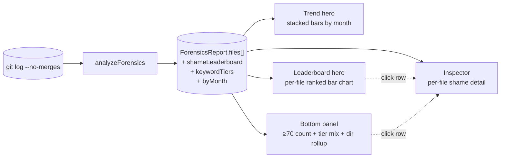

# Shame

**Shame** scores each file by what its commit messages *confess*. Words like `revert`, `hotfix`, `hack`, and `fix` betray work that didn't go cleanly the first time — a single one is noise, but a sustained pattern across many commits to the same file is a real signal that the file has been struggling. The analyzer reads every commit message, weights matches by tier, normalizes against the file's commit count, and dampens scores for files without enough history to trust the ratio.

The Shame analyzer answers two questions on the same screen:

- **"Is shame trending up over time, and is the severity mix shifting?"** — the temporal view.
- **"Which files actually carry sustained shame today?"** — the leaderboard view.

Each lens covers a question the other can't: a leaderboard tells you *who* but not *whether things are getting worse*; a trend tells you *whether* but not *who*. Both heroes share the tab area; neither subsumes the other.

Why the analyzer is named "forensics" in the codebase but "Shame" in the dashboard: forensics is the broader category — reading what commits *say* rather than what they *do* — and shame is the specific lens this analyzer applies. Future forensic analyzers (e.g. mass-revert detection) would ship under the same `forensics.ts` file but get their own dashboard preset.

::: tip Screenshot
**TODO:** Capture the Shame analyzer view (sidebar selection, `Trend` hero default tab, `Leaderboard` alt tab, bottom-panel narrative-KPI with "where they live" extras, right-side Inspector populated). Save to `apps/docs/public/images/analyzers/shame-overview.png`, then replace this callout with ``.
:::

## Quick read

If you only have ten seconds:

- **Top of the screen** (`Trend` hero, default tab) — stacked bars per month, three layers: critical / moderate / mild commit counts. Read left-to-right for direction; read each bar's color mix for severity.
- **Top of the screen** (`Leaderboard` alt tab) — horizontal bar chart of files passing the 5-commit confidence floor, ranked by `shameScore`, bar color = file's dominant keyword tier.
- **Bottom panel** (narrative KPI) — count of files with `shameScore ≥ 70`, tier-mix subline, and a "where they live" directory rollup.
- **Right-side Inspector** — click any file row in another analyzer's tab to see its shame score alongside hotspot, churn, ownership, age, and the rest.

## How shame is measured

The full pipeline, from raw git output to the dashboard surfaces:



Every commit message is scanned against three tiers of keywords. Each match adds the tier's weight to the file's raw shame points, then the score normalizes against the file's total commit count, then a confidence multiplier dampens scores for files without enough history.

### The three keyword tiers

| Tier | Weight | Keywords |
|---|---|---|
| **Critical** | 3 | `revert`, `hotfix`, `oops`, `fixup`, `broke` |
| **Moderate** | 2 | `hack`, `workaround`, `temporary`, `temp`, `kludge`, `band-aid` |
| **Mild** | 1 | `fix`, `bug`, `wrong`, `mistake`, `typo`, `cleanup` |

Matching is case-insensitive and whole-word only — `"fixing"` does not match `fix`, `"unbroken"` does not match `broke`. A commit message can score in multiple tiers (`"revert hotfix"` adds 6 points, both tier-3 entries firing).

The tiers are deliberately coarse. A `revert` is a stronger admission than a `fix`, and the 3:2:1 weight ratio reflects that ordering without overcommitting to false precision. Tier weights are not user-configurable in v1 — when a repo's vocabulary diverges enough to need different keywords, that's a config-file problem, not a slider problem.

### The score formula

For each file, the analyzer computes:

```
rawScore   = (rawShamePoints / totalCommitsForFile) × 100
confidence = min(1, totalCommitsForFile / 5)
shameScore = min(round(rawScore × confidence), 100)
```

The **ratio** in `rawScore` makes shame proportional: a file with one revert in two commits scores higher than a file with one revert in 100, because the percentage of "bad" commits is higher in the first case. Without the ratio, long-lived files would dominate purely by accumulating points.

The **confidence multiplier** dampens scores for files that haven't lived long enough to trust the ratio. The floor is 5: a file with fewer than 5 commits gets scaled down proportionally (a 1-commit YAML whose only message says `"fix"` falls from 100 to 20), and only files with 5 or more commits can reach the full ratio.

Why the multiplier matters: without it, single-commit YAMLs and config files dominate the leaderboard. Any file whose only commit happens to mention `fix` ties at 100 with files carrying years of sustained shame. The multiplier preserves the ratio-based score for short-lived files (so they're still visible in the Inspector and in cross-analyzer scoring) while keeping the leaderboard reserved for files with enough history to mean something.

A few specifics worth knowing:

- **Window:** the full reachable history of the analyzed branch, bounded by `--since=<date>` if provided.
- **Merge commits are excluded.** A merge commit's message is metadata, not a confession.
- **Only currently-tracked files are scored.** Files deleted before scan time are filtered out, even if their commits still appear in the log.
- **Renames are *not* followed.** Pre-rename shame is attributed to the old path. The [Rename Tracking](/analyzers/renames) analyzer surfaces these chains explicitly.

### What the leaderboard contains

`shameLeaderboard` is the top 10 files by `shameScore`, **filtered to files with at least 5 commits**. Files that score high but didn't pass the confidence floor still appear in `files[]` (and in the Inspector when surfaced from another analyzer's tab) — they're just held off the leaderboard so the leaderboard reads cleanly.

## Reading the surfaces

### The hero — `Trend` (default tab)

A stacked bar chart with one bar per month across the analyzed window. Each bar has three layers, colored by tier:

- **Red (Critical)** — commits matching tier-3 keywords (`revert`, `hotfix`, `oops`, `fixup`, `broke`).
- **Orange (Moderate)** — commits matching tier-2 keywords (`hack`, `workaround`, `temporary`, `temp`, `kludge`, `band-aid`).
- **Yellow (Mild)** — commits matching tier-1 keywords (`fix`, `bug`, `wrong`, `mistake`, `typo`, `cleanup`).

A commit is counted once per bar, in its highest matched tier — a `"revert hack fix"` commit lands in *Critical*, not in all three.

The hero answers **"is shame trending up, and is the severity mix shifting?"** Three shapes worth recognizing:

- **Mostly-yellow with a flat or downward trend** — healthy. Mild-tier vocabulary is a normal part of any active codebase. As long as the tier-3 layer stays thin and the overall height isn't growing, the team is doing routine bug-fixing rather than fire-fighting.
- **Rising red layer** — a recent uptick in `revert` / `hotfix` / `oops` is the most actionable signal in the analyzer. It says the team has been shipping things that needed reverting, not just things that needed fixing. A retro on the recent weeks is the right next step.
- **Sustained tall bars across many months** — the codebase has been on fire for a while. Open the Leaderboard tab next; the file-level view tells you where the heat is concentrated.

### The hero — `Leaderboard` (alt tab)

A horizontal bar chart of the top 10 files by `shameScore`, ranked descending. Each row is filtered to files passing the 5-commit confidence floor, so the leaderboard never includes single-commit YAMLs or new files with one accidental keyword match.

Each bar's color encodes the file's **dominant keyword tier** — the tier that contributed the most points to the file's raw shame total. A file whose top keyword is `revert` shows red even if it also has `fix` matches; a file whose only matches are `cleanup` and `typo` shows yellow.

The hero answers **"which files actually carry sustained shame?"** — a per-file leaderboard, severity-weighted. Click any row to populate the right-side Inspector with the file's full per-file profile, including its top three shame commits and dominant keywords.

### The bottom panel — narrative KPI

A single panel, not a table. The left-side big number is **the count of files with `shameScore` ≥ 70**, badge-colored by severity (0 = Healthy, 1–9 = Moderate, 10+ = High Shame). The thresholds mirror Blast Radius's absolute-count thresholds so the headline is comparable across analyzers — high-shame files are uncommon at any repo size, so absolute thresholds read more cleanly than proportional ones.

The right side carries two pieces of context:

1. **Tier-mix subline** — `N` shame commits across the repo, broken down as **X** critical (revert / hotfix / oops) · **Y** moderate (hack / workaround) · **Z** mild (fix / bug). The tier weighting is unique to this analyzer, and the subline carries it: it grounds the headline number in the kind of shame the repo actually has, not just the volume.
2. **File-count subline** — the total number of files with any shame signal across the repo. This is the full denominator behind the tier-mix counts above (each shame commit lives in one of these files); it's not the floor-passing leaderboard count, which is shown in the Leaderboard hero's caption instead.

There is also a **"Where they live"** rollup that answers the directory-level question: *if I want to attack the shame, where do I look first?* Each row shows the immediate parent directory, the number of high-shame (`≥70`) files inside it, the share of the repo's total high-shame count, and a small bar visualizing that count relative to the largest directory. Top 5 directories, sorted by count desc with alphabetical tiebreak. When more than 5 distinct directories hold high-shame files, the rollup ends with a `+ N more directories` line so the long tail is acknowledged rather than silently truncated.

Why a KPI and not a table: the Leaderboard hero already shows the worst per-file scores; the Trend hero shows the over-time picture; the Inspector shows full per-file detail on click. The aggregate count — *how many files in this repo carry sustained shame* — and the tier mix and directory roll-up are the three questions none of the other surfaces answer. A sortable file table would just rotate the Leaderboard.

The sticky **See also** footer links to two related analyzers:

- **Cursed Files** — multi-dimensional risk score that includes shame alongside churn, ownership concentration, age anomalies, and coupling. Files at the intersection of "bad in many ways."
- **Bus Factor** — ownership concentration. A high-shame file owned by a single author is a much worse problem than a high-shame file with broad ownership; pair the two views to triage.

### The right-side Inspector

Click any file row in another analyzer's tab and the Inspector populates with that file's full per-file profile, including `Shame` (the score), the file's top three shame commits (hash, message, date, points, keywords), and its dominant keywords. The Inspector is the **per-file detail surface** — the bottom-panel rollup intentionally omits per-file detail because it would just rotate the Leaderboard.

## What action it suggests

Shame is a triage signal, not an indictment. A few patterns to act on:

- **Critical-tier files (red bars at the top of the Leaderboard)** — these are the strongest refactor candidates. A file whose history reads `revert / hotfix / fixup / broke` over and over has been resisting clean changes; a focused refactor pass usually pays for itself within a few sprints.
- **Rising trend in the Critical layer** — run a retro on commit-message hygiene and shipping discipline. The recent uptick is the most actionable piece of the analyzer; don't wait for it to flatten on its own.
- **Concentrated directory in the rollup** — when a single directory holds half or more of the repo's high-shame files, consider whether ownership is too narrow or the module's contracts are too brittle. Splitting ownership or introducing clearer interfaces often helps.
- **High-shame file with single ownership** (cross-reference with [Bus Factor](/analyzers/bus-factor)) — the file is both struggling *and* under-witnessed. Pair-program the next change there, or rotate review responsibility.

## Limitations

- **Heuristic keyword matching.** The analyzer matches whole-word, case-insensitive keywords against the commit message body. False positives happen — a commit titled `"add fixture for broken-link tests"` matches `broke` even though nothing is actually broken. False negatives happen — a team that uses non-English commit messages, emoji-only commits, or branch-merge commits with no description goes unscored. Read the Trend and Leaderboard together with the actual commit messages (visible in the Inspector); the analyzer is a starting point for triage, not a verdict.
- **Tier weights are not user-configurable.** The 3 / 2 / 1 weighting is baked in. Repos with a vocabulary that diverges substantially from the default keyword set (e.g. teams that say `revert` rarely but `unbreak` constantly) will under-detect critical-tier shame. Future versions may surface a repo-level keyword config; for now the keyword list is hardcoded in `packages/core/src/analyzers/forensics.ts`.
- **Confidence floor delays signal for new files.** Files with fewer than 5 commits get their score scaled down proportionally, which means a freshly-created file that has already been reverted twice might score only 40 even though the pattern is real. The Inspector still shows the raw shame commits; the leaderboard just won't surface the file until it earns 5 commits of history.
- **Trend bins by month, not week.** Short-lived spikes inside a single month get smoothed into a flat bar. For weekly resolution, see [Commit Timing](/analyzers/commit-timing) — its lens is different but it picks up high-frequency patterns the monthly Trend hides.
- **Renames break continuity.** A file's shame history is attributed to its current path; pre-rename commits are scored against the old path. See [Rename Tracking](/analyzers/renames).
- **Pre-1.0.** Keywords, tier weights, the confidence floor, and the leaderboard cap may change. See [CHANGELOG](https://github.com/nebulord-dev/gitrelic/blob/main/CHANGELOG.md) for shifts.

## Related analyzers

- **[Cursed Files](/analyzers/cursed-files)** — multi-dimensional risk score combining shame, churn, ownership concentration, age anomalies, and coupling. The cursed-files analyzer reads `shameScore` directly; its 75 / 50 / 25 thresholds for shame contribution are stable across the confidence-multiplier change.
- **[Bus Factor](/analyzers/bus-factor)** — ownership concentration per file. A high-shame file with a high bus-factor risk is the most urgent kind of file: it's struggling *and* it has nobody else who knows it.
- **[Web Dashboard](/dashboard/)** — the rendering layer that hosts the Trend / Leaderboard heroes and the narrative-KPI bottom panel.
